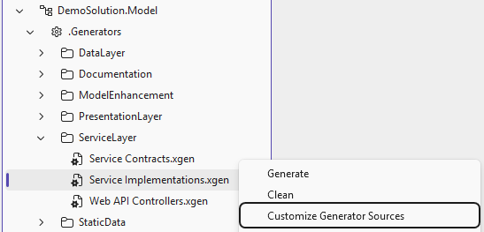
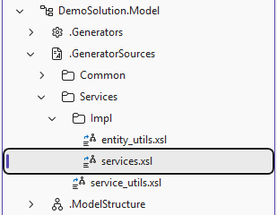
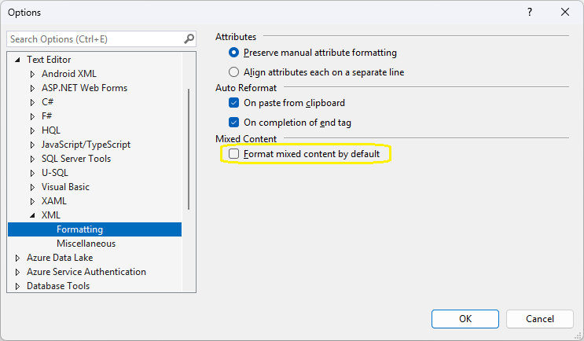
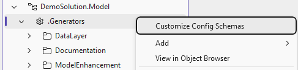
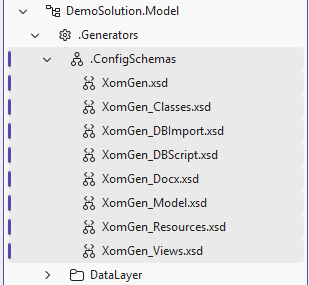
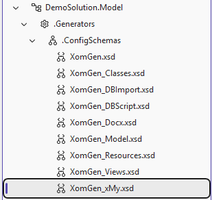
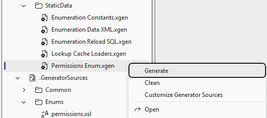

# Customizing generators

Aside from [extending the model structure](model) with custom elements and attributes and [enhancing the model editor](editor), the main value of extending Xomega.Net comes from being able to [**customize existing generators**](#customizing-existing-generators) to create code for your specific requirements, as well as to [**add new generators**](#adding-new-custom-generators) for generating any additional code that you may need in your solution.

Both custom existing generators and new generators can [use custom model extensions](#using-model-extensions-in-generators) that you define and may require [custom generator configurations](#custom-generator-configurations) that you can also provide in your solution. 

In this section, we will illustrate how to customize existing generators and add new generators using simple examples, but you can apply the same principles to create more complex customizations and generators as needed for your solution.

At the end, we will also provide some tips and best practices for troubleshooting and [debugging generators](#debugging-generators), as well as [additional resources](#additional-resources) that will help you when developing your custom generators.

:::note
Accessing generators' source code and customizing them requires the **Full license** of the Xomega.Net for Visual Studio. However, you can try it for the *Database Schema* generator with the *60-day Evaluation license*.
:::

## Customizing existing generators

Customizing existing generators requires accessing their source code and modifying it, so that it generates code according to your specific requirements. Accessing generator source code also allows you to understand how the generators work and troubleshoot any issues that may arise during code generation.

Let's imagine that we want to customize the way **service implementations** are generated in our solution. Specifically, we want to extend the generated services that currently inherit from the [`BaseService`](../../framework/services/common#base-service-class) class in the Xomega Framework with additional common functionality that we can use in the customized services.

To do that, we will want the generated services to inherit from our own **custom base service class**, e.g. `MyBaseService`, which will provide the additional custom functionality for all generated services. 
The path to the generator source code is specified in the `Xsl` attribute in the generator configuration file `Service Implementations.xgen`, as shown below.

```xml title="Service Implementations.xgen"
...
<!-- highlight-next-line -->
<Generator Xsl="Services/Impl/services.xsl"
           GeneratorGroup="services"
           IncludeInBuild="true"
           IndividualFiles="true"/>
...
```

This path is relative to the generator sources directory inside Xomega SDK, which contains the source code for all generators in binary form. First of all, we will need to retrieve the source code for the generator we want to customize in plain text form, and place it in our solution, so that we can modify it.

### Customizing generator sources

In order to get the source code files for a specific generator for customization, you can right-click on the generator configuration file in the Solution Explorer and select the *Customize Generator Sources* command from the context menu, as shown below.



This will place the source code files for the selected generator in the `.GeneratorSources` directory in your solution using the same relative path as in the generator configuration, i.e. `Services/Impl/services.xsl` in our case, as shown below.



In addition to the main generator stylesheet, which is `services.xsl` in our case, this will also copy the source code for any imported stylesheets, as well as stylesheets imported by those stylesheets, and so on, so that you have the full source code for the generator and all its dependencies available for customization.

For example, if you open the `services.xsl` file, you will see that it imports several other stylesheets, such as `generator_base.xsl`, `service_utils.xsl`, and `entity_utils.xsl` as shown below.

```xml title="services.xsl"
<!-- highlight-next-line -->
<xsl:stylesheet version="2.0"
                xmlns:xsl="http://www.w3.org/1999/XSL/Transform"
                ...
                xmlns:cls="http://schemas.xomega.net/v10/xgen/classes">
<!-- highlight-start -->
  <xsl:import href="../../Common/generator_base.xsl"/>
  <xsl:import href="../service_utils.xsl"/>
  <xsl:import href="entity_utils.xsl"/>
<!-- highlight-end -->
  ...
</xsl:stylesheet>
```

Each of these stylesheets is also placed in the same relative path in the `.GeneratorSources` directory, which allows you to set the cursor on the import statement and navigate to the source code for the imported stylesheet by pressing F12 or using the *Go To Definition* context menu command.

:::warning
While the **imported stylesheets** are copied to the `.GeneratorSources` directory for your reference and navigation convenience, they will **override the original stylesheets** in the Xomega SDK during code generation, which may pose issues when you upgrade the Xomega SDK to a newer version. To avoid this, you can **delete the unmodified imported stylesheets** after you no longer need their source code.

You can always retrieve the latest versions of the imported stylesheets from the Xomega SDK if needed by using the *Customize Generator Sources* command again, which will copy the latest versions of the stylesheets to your solution.
:::

### Customizing generator sources directory

By default, the generator sources are placed in the `.GeneratorSources` directory in your solution, but you can change this directory to any other directory in your solution by updating the `CustomGeneratorXslDir` property and the corresponding `Include` path in your project file, as shown below.

```xml title="DemoSolution.Model.xomproj"
<Project Sdk="Xomega.Sdk/10.0.1">
  ...
  <PropertyGroup>
<!-- removed-next-line -->
    <CustomGeneratorXslDir>$(MSBuildProjectDirectory)\.GeneratorSources</CustomGeneratorXslDir>
<!-- added-next-line -->
    <CustomGeneratorXslDir>$(MSBuildProjectDirectory)\.MySources</CustomGeneratorXslDir>
  </PropertyGroup>
  ...
  <ItemGroup>
<!-- removed-next-line -->
    <Template Include=".GeneratorSources\**\*.xsl" />
<!-- added-next-line -->
    <Template Include=".MySources\**\*.xsl" />
  </ItemGroup>
</Project>
```

Any custom generator sources that you place in the specified directory will override the original generator sources in the Xomega SDK during code generation, which allows you to customize the generators as needed.

### XSL formatting settings

The XSL-based generators output any text content in the templates as-is, including any whitespace characters, such as spaces, tabs, and newlines. Therefore, it's important to ensure that Visual Studio doesn't automatically format such text content when you edit the XSL files, especially when you copy and paste the markup or code.

To prevent Visual Studio from automatically formatting the text content in XSL files, make sure to uncheck the "*Format mixed content by default*" option in the XML formatting settings, as shown below.



:::note
The all-whitespace text content between the XSL elements, including XML comments, is ignored during code generation, but any other text content, including the whitespace characters surrounding it, is preserved as-is in the generated code.
:::

### Updating generator stylesheets

Let's assume that you want all generated services to inherit from your custom base service class `MyBaseService` from the `MyFramework.Services` namespace instead of the default `BaseService` class from the Xomega Framework, as illustrated below.

```cs title="MyBaseService.cs"
using System;
using Xomega.Framework.Services;

/* highlight-next-line */
namespace MyFramework.Services
{
/* highlight-next-line */
    public class MyBaseService : BaseService
    {
        public MyBaseService(IServiceProvider serviceProvider) : base(serviceProvider)
        {
        }
        // Custom base service logic for all services
    }
}
```

To implement this change, you can open the main generator stylesheet `services.xsl` and update the template `generate-services` to use the new base service class and namespace, as shown below.

```xml title="services.xsl"
<xsl:stylesheet version="2.0" ...>
  ...
<!-- highlight-next-line -->
  <xsl:template name="generate-services">
    ...
<!-- added-next-line -->
    <namespace value="MyFramework.Services"/>
<!-- removed-next-line -->
    public partial class <xsl:value-of select="f:camel(@name)"/>Service : BaseService, I<xsl:value-of select="f:camel(@name)"/>Service
<!-- added-next-line -->
    public partial class <xsl:value-of select="f:camel(@name)"/>Service : MyBaseService, I<xsl:value-of select="f:camel(@name)"/>Service
    ...
  </xsl:template>
  ...
</xsl:stylesheet>
```

:::note
The namespace element that we added is not output as is. Instead, the generator checks all `namespace` elements in the generated output and adds the corresponding unique and sorted `using` statements at the top of the generated file.
:::

If you run the `Service Implementations` generator after this change, you will see that all generated services now inherit from the `MyBaseService` class in the `MyFramework.Services` namespace, as shown below.

```cs title="PersonService.cs"
/* highlight-next-line */
using MyFramework.Services;
...
namespace DemoSolution.Services.Entities
{
/* highlight-next-line */
    public partial class PersonService : MyBaseService, IPersonService
    {
...
```

## Custom generator configurations

Now let's assume that you don't want to hardcode the base service class and namespace in the generator stylesheet, but instead want to specify them in the generator configuration file, so that you can easily change them without modifying the generator source code. To do that, you can define a custom generator configuration schema with the necessary elements and attributes for specifying the base service class and namespace, and then use those elements and attributes in the generator stylesheet.

### Customizing generator config schemas

By default, the schemas for generator configuration files come with the Xomega SDK. To provide custom generator configuration schemas, you need to customize all generator config schemas by copying them from the Xomega SDK to your solution, since all generator config schemas need to be in the same directory. To do that, you can right-click on the `.Generators` folder in the Solution Explorer and select the *Customize Config Schemas* command from the context menu, as shown below.



This will place all generator config schemas that are used in your solution in the `.MyConfigSchemas` directory under the `.Generators` folder, as shown below.



:::tip
If you later add generator configs that require additional config schemas supplied with the Xomega SDK that were not previously copied to your solution, you can use the *Customize Config Schemas* command again to copy the missing schemas to your solution.
:::

### Customizing config schemas directory

If you want to change the directory for custom generator config schemas, you can update the `CustomGeneratorSchemasDir` property and the corresponding `Include` path in your project file, as shown below.

```xml title="DemoSolution.Model.xomproj"
<Project Sdk="Xomega.Sdk/10.0.1">
  ...
  <PropertyGroup>
<!-- removed-next-line -->
    <CustomGeneratorSchemasDir>$(MSBuildProjectDirectory)\.Generators\.ConfigSchemas</CustomGeneratorSchemasDir>
<!-- added-next-line -->
    <CustomGeneratorSchemasDir>$(MSBuildProjectDirectory)\.MyConfigSchemas</CustomGeneratorSchemasDir>
  </PropertyGroup>
  ...
  <ItemGroup>
<!-- removed-next-line -->
    <Template Include=".Generators\.ConfigSchemas\*.xsd" />
<!-- added-next-line -->
    <Template Include=".MyConfigSchemas\*.xsd" />
  </ItemGroup>
</Project>
```

### Adding new custom config schemas

Next, you need to add a new custom generator config schema to the `.CustomConfigSchemas` directory, which will import the main generator config schema `XomGen.xsd` and extend it with the necessary elements and attributes for specifying the base service class and namespace.

The custom config schema should be listed after any schemas that it imports in the directory, so it's recommended to name it such that it comes after all the standard config schemas, e.g. `XomGen_xMy.xsd`, as shown below.



In your custom config schema, you need to specify the custom target namespace and import the main generator config schema `XomGen.xsd`, and then declare your new config element with substitution group `xgen:ConfigElement` and extended `xgen:GeneratorConfigType` type, where you can add the elements and attributes for specifying the base service class and namespace, as shown in the following snippet.

```xml title="XomGen_xMy.xsd"
<xs:schema xmlns:xs="http://www.w3.org/2001/XMLSchema"
<!-- highlight-start -->
           targetNamespace="http://schemas.mydomain.net/v10/xgen/custom"
           xmlns:tns="http://schemas.mydomain.net/v10/xgen/custom"
<!-- highlight-end -->
           xmlns:xgen="http://schemas.xomega.net/v10/xgen"
           elementFormDefault="qualified">

<!-- highlight-start -->
  <xs:import namespace="http://schemas.xomega.net/v10/xgen" 
             schemaLocation="XomGen.xsd"/>
<!-- highlight-end -->

<!-- highlight-next-line -->
  <xs:element name="Services" substitutionGroup="xgen:ConfigElement">
    <xs:complexType>
      <xs:complexContent>
<!-- highlight-next-line -->
        <xs:extension base="xgen:GeneratorConfigType">
          <xs:sequence>
            <xs:element name="BaseService" minOccurs="0" maxOccurs="1">
              <xs:complexType>
                <xs:attribute name="Name" type="xs:string" use="required"/>
                <xs:attribute name="Namespace" type="xs:string" use="required"/>
              </xs:complexType>
            </xs:element>
          </xs:sequence>
        </xs:extension>
      </xs:complexContent>
    </xs:complexType>
  </xs:element>

</xs:schema>
```

:::tip
To provide tooltip descriptions for the new config elements and attributes in the editor, **add documentation annotations** to the schema for the corresponding elements and attributes, as they were omitted in the example above for the sake of brevity.
:::

### Using custom generator configs

After you define the custom generator config schema, you can use the new config elements and attributes in your generator configuration file, as shown below.

```xml title="Service Implementations.xgen"
<XomGeneratorConfig xmlns="http://schemas.xomega.net/v10/xgen"
<!-- added-next-line -->
                    xmlns:mycfg="http://schemas.mydomain.net/v10/xgen/custom"
                    xmlns:cls="http://schemas.xomega.net/v10/xgen/classes">

  <Generator Xsl="Services/Impl/services.xsl" .../>

<!-- added-lines-start -->
  <mycfg:Services>
    <mycfg:BaseService Name="MyBaseService" Namespace="MyFramework.Services"/>
  </mycfg:Services>
<!-- added-lines-end -->

</XomGeneratorConfig>
```

Finally, you can update the generator stylesheet to use the new config elements and attributes instead of hardcoding the base service class and namespace. If the config elements and attributes are not specified in the generator configuration file, it should fall back to the default base service class and namespace, as shown below.

```xml title="services.xsl"
<xsl:stylesheet version="2.0"
                ...
<!-- added-next-line -->
                xmlns:mycfg="http://schemas.mydomain.net/v10/xgen/custom"
                xmlns:cls="http://schemas.xomega.net/v10/xgen/classes">
  ...
<!-- highlight-next-line -->
  <xsl:template name="generate-services">
    ...
<!-- added-lines-start -->
    <xsl:variable name="defaultBase">
      <service Name="BaseService" Namespace="Xomega.Framework.Services"/>
    </xsl:variable>
    <xsl:variable name="baseService" select="(
                  $GenConfig/*/mycfg:Services/mycfg:BaseService, $defaultBase/service)[1]"/>
<!-- added-lines-end -->
<!-- removed-next-line -->
    <namespace value="MyFramework.Services"/>
<!-- added-next-line -->
    <namespace value="{$baseService/@Namespace}"/>
<!-- removed-next-line -->
    public partial class <xsl:value-of select="f:camel(@name)"/>Service : MyBaseService, I<xsl:value-of select="f:camel(@name)"/>Service
<!-- added-lines-start -->
    public partial class <xsl:value-of select="concat(f:camel(@name), 'Service : ',
                                       $baseService/@Name, ', I', f:camel(@name), 'Service')"/>
<!-- added-lines-end -->
    ...
  </xsl:template>
  ...
</xsl:stylesheet>
```

As you can see, we define the default base service class using a variable with a `service` element and the same structure as in the config schema, so that we can set the `baseService` variable to be the first non-empty value among the config element and the default value. Then we use the `baseService` variable to set the namespace and base class for the generated services.

:::note
We also refactored the class declaration to `concat` the values and string literals in the `xsl:value-of` element, which makes it less verbose and easier to read, as it allows formatting values on multiple lines unlike the text content where whitespace matters.
:::

## Using model extensions in generators

Now imagine that in addition to specifying the base service class and namespace in the generator configuration file, you also want to specify them in the model itself, so that you can have different base service classes for different objects in the same solution. To do that, you can define a custom model extension schema with the necessary elements and attributes for specifying the base service class and namespace, and then use those elements and attributes in the generator stylesheet.

### Defining model extension schema

To define a custom model extension schema, you need to [Customize Model Schemas](model#customizing-model-schemas), and then [add your custom schema](model#adding-new-model-elements) and  [add an element extension](model#adding-element-extensions) for the `object` element in your custom model extension schema, where you can add the elements and attributes for specifying the base service class and namespace, as shown in the following snippet.

```xml title="Xomega_xMy.xsd"
<xs:schema xmlns="http://www.mydomain.net/xomega"
           targetNamespace="http://www.mydomain.net/xomega"
           ...>
<!-- highlight-next-line -->
  <xs:element name="services" substitutionGroup="o:object-extension">
    <xs:complexType>
      <xs:complexContent>
<!-- highlight-next-line -->
        <xs:extension base="o:objectConfigurationExtension">
          <xs:sequence>
<!-- highlight-start -->
            <xs:element name="base-service" minOccurs="0" maxOccurs="1">
              <xs:complexType>
                <xs:attribute name="Name" type="xs:string" use="required"/>
                <xs:attribute name="Namespace" type="xs:string" use="required"/>
              </xs:complexType>
            </xs:element>
<!-- highlight-end -->
          </xs:sequence>
        </xs:extension>
      </xs:complexContent>
    </xs:complexType>
  </xs:element>
</xs:schema>
```

:::note
To simplify the code in the generator stylesheet, we used the same attribute names for the `base-service` element in the model extension schema as in the generator config schema, even though they use a slightly different naming convention.
:::

### Specifying object extension in the model

Let's say that in addition to the default base service class `MyBaseService` you have specialized base service classes that provide additional functionality for specific groups of services, e.g. `MyCachingBaseService` for services that require caching functionality.

If you want the service for the `person` object to inherit from the `MyCachingBaseService` class instead of the default `MyBaseService` class, you can specify that in the model by adding the `my:services` object extension with the `my:base-service` element and attributes for the base service class name and namespace, as shown below.

```xml title="person.xom"
<module xmlns="http://www.xomega.net/omodel"
        ...
        xmlns:my="http://www.mydomain.net/xomega"
        name="person">
  <object name="person">
    <fields>[...]
    <operations>[...]
    <config>
      <sql:table name="Person.Person">[...]
<!-- added-lines-start -->
      <my:services>
        <my:base-service Name="MyCachingBaseService" Namespace="MyFramework.Services"/>
      </my:services>
<!-- added-lines-end -->
    </config>
  </object>
</module>
```

:::note
You could've defined the `my:base-service` element as a direct child of the `config` element without the `my:services` wrapper element, but we added the wrapper element to allow for future extensions related to services.
:::

### Updating generator to use model extension

To update the generator to use the new model extension, you need to add the custom model extension namespace, and then just update the `baseService` variable to include the new model extension element as the first option in the sequence, as shown below.

```xml title="services.xsl"
<xsl:stylesheet version="2.0"
                ...
<!-- added-next-line -->
                xmlns:my="http://www.mydomain.net/xomega"
                xmlns:mycfg="http://schemas.mydomain.net/v10/xgen/custom"
                xmlns:cls="http://schemas.xomega.net/v10/xgen/classes">
  ...
<!-- highlight-next-line -->
  <xsl:template name="generate-services">
    ...
    <xsl:variable name="defaultBase">
      <service Name="BaseService" Namespace="Xomega.Framework.Services"/>
    </xsl:variable>
<!-- removed-next-line -->
    <xsl:variable name="baseService" select="(
<!-- added-next-line -->
    <xsl:variable name="baseService" select="(o:config/my:services/my:base-service,
                  $GenConfig/*/mycfg:Services/mycfg:BaseService, $defaultBase/service)[1]"/>
<!-- highlight-start -->
    <namespace value="{$baseService/@Namespace}"/>
    public partial class <xsl:value-of select="concat(f:camel(@name), 'Service : ',
                                       $baseService/@Name, ', I', f:camel(@name), 'Service')"/>
<!-- highlight-end -->
    ...
  </xsl:template>
  ...
</xsl:stylesheet>
```

If you run the `Service Implementations` generator after this change, you will see that the generated service for the `person` object now inherits from the `MyCachingBaseService` class in the `MyFramework.Services` namespace, while the services for other objects still inherit from the default `MyBaseService` class, as shown below.

```cs title="PersonService.cs"
/* highlight-next-line */
using MyFramework.Services;
...
namespace DemoSolution.Services.Entities
{
/* highlight-next-line */
    public partial class PersonService : MyCachingBaseService, IPersonService
    {
...
```

## Adding new custom generators

Adding new custom generators is similar to customizing existing generators, but instead of modifying the source code for an existing generator, you will create a new stylesheet for your generator and a new generator configuration file that references the new stylesheet. Your generator can also use custom model extensions and generator configs that you define in your custom schemas.

We will illustrate this by adding a simple generator that generates an `AppPermissions` enum based on the permissions defined in the model using a custom model extension. You can then use permissions from the generated enum in your code to define authorization policies and apply them to your services and operations.

### Defining object permissions

We'll start by [customizing the model schema](model#customizing-model-schemas) and [adding an object extension](model#adding-element-extensions) in the custom schema that allows us to define permissions with specific actions for each object in the model, as shown in the following snippet.

```xml title="Xomega_xMy.xsd"
<xs:schema xmlns="http://www.mydomain.net/xomega"
           targetNamespace="http://www.mydomain.net/xomega"
           ...>
<!-- highlight-next-line -->
  <xs:element name="permissions" substitutionGroup="o:object-extension">
    <xs:complexType>
      <xs:complexContent>
        <xs:extension base="o:objectConfigurationExtension">
          <xs:sequence>
<!-- highlight-next-line -->
            <xs:element name="permission" maxOccurs="unbounded">
              <xs:complexType>
<!-- highlight-next-line -->
                <xs:attribute name="action" type="xs:string"/>
              </xs:complexType>
            </xs:element>
          </xs:sequence>
        </xs:extension>
      </xs:complexContent>
    </xs:complexType>
  </xs:element>
</xs:schema>
```

After that, you can specify permissions for each object in the model, such as the `person` object, by adding them in the `my:permissions` object extension under the `config` element, as shown below.

```xml title="person.xom"
<module xmlns="http://www.xomega.net/omodel"
        ...
        xmlns:my="http://www.mydomain.net/xomega"
        name="person">
<!-- highlight-next-line -->
  <object name="person">
    <fields>[...]
    <operations>[...]
    <config>
      <sql:table name="Person.Person">[...]
<!-- added-lines-start -->
      <my:permissions>
        <my:permission action="create"/>
        <my:permission action="read"/>
        <my:permission action="update"/>
        <my:permission action="delete"/>
      </my:permissions>
<!-- added-lines-end -->
    </config>
  </object>
</module>
```

Here we defined standard CRUD permissions for the `person` object, but you can define any custom permissions with any actions as needed for your solution.

### Adding permissions global config

The generator for permissions enum will need to know the name and namespace for the generated enum. If you specify those in the generator config, other generators that might need to reference the generated enum won't be able to access that configuration, so the best way to specify that is in the global model config, which is accessible to any generator as part of the model.

To be able to specify the enum name and namespace in the global model config, you need to add a new [global configuration extension](model#adding-global-configurations) element in your custom model extension schema, as shown in the following snippet.

```xml title="Xomega_xMy.xsd"
<xs:schema xmlns="http://www.mydomain.net/xomega"
           targetNamespace="http://www.mydomain.net/xomega"
           ...>
<!-- highlight-next-line -->
  <xs:element name="permissions-config" substitutionGroup="o:model-extension">
    <xs:complexType>
      <xs:complexContent>
        <xs:extension base="o:modelConfigurationExtension">
<!-- highlight-start -->
          <xs:attribute name="enumName" type="xs:string"/>
          <xs:attribute name="namespace" type="xs:string"/>
<!-- highlight-end -->
        </xs:extension>
      </xs:complexContent>
    </xs:complexType>
  </xs:element>
</xs:schema>
```

With this global configuration extension in place, you can specify the `enumName` and `namespace` for the generated permissions enum in the global model config, as shown below.

```xml title="global_config.xom"
...
<!-- added-lines-start -->
<my:permissions-config
  enumName="AppPermissions"
  namespace="DemoSolution.Services.Common.Security"
/>
<!-- added-lines-end -->
...
```

:::note
You will need to keep the values of the `enumName` and `namespace` attributes consistent with the folder structure and the file name of the generator's output path respectively to follow the best practices for .NET projects.
:::

### Adding Permissions Enum generator

Now you need to create a new generator stylesheet `permissions.xsl` for the generator and place it in the `Enums` folder (or any other folder of your choice) under the `.GeneratorSources` directory. You need to add your custom namespace and import the `generator_base.xsl` stylesheet, and then implement the template for generating the permissions enum based on the permissions defined in the model, as shown in the following snippet.

```xml title="Enums/permissions.xsl"
<xsl:stylesheet version="2.0"
                xmlns:xsl="http://www.w3.org/1999/XSL/Transform"
<!-- highlight-next-line -->
                xmlns:my="http://www.mydomain.net/xomega"
                xmlns:f="http://www.xomega.net/format"
                xmlns:o="http://www.xomega.net/omodel">
<!-- highlight-next-line -->
  <xsl:import href="../Common/generator_base.xsl"/>

  <xsl:template match="/">
    <xsl:result-document href="{$OutputPath}" method="text">
      <xsl:call-template name="auto-generated-header"/>
<!-- highlight-next-line -->
      <xsl:variable name="cfg" select="root()/*/o:config/my:permissions-config"/>
namespace <xsl:value-of select="($cfg/@namespace, 'Security')[1]"/>
{
    public enum <xsl:value-of select="($cfg/@enumName, 'AppPermissions')[1]"/>
<!-- highlight-start -->
    {<xsl:for-each select="//my:permission">
        <xsl:value-of select="concat(f:get-indent(8), f:camel(ancestor::o:object[1]/@name), f:camel(@action), ',')"/>
    </xsl:for-each>
    }
<!-- highlight-end -->
}
</xsl:result-document>
  </xsl:template>

</xsl:stylesheet>
```

As you can see, the generator selects our global config element for permissions and uses the specified `namespace` and `enumName` attributes to set the namespace and name for the generated enum. If those attributes are not specified, it uses the default values `Security` for the namespace and `AppPermissions` for the enum name. Then it iterates over all `my:permission` elements in the model and generates an enum member for each permission qualified with the object name and the action.

Finally, you need to add a new generator configuration file `Permissions Enum.xgen` under a subfolder of the `.Generators` node, e.g.  `StaticData`, which references the new generator stylesheet, and specify the output path for the generated enum, as shown below.

```xml title="Permissions Enum.xgen"
<XomGeneratorConfig xmlns="http://schemas.xomega.net/v10/xgen"
                    xmlns:cls="http://schemas.xomega.net/v10/xgen/classes">

<!-- highlight-next-line -->
  <Generator Xsl="Enums/permissions.xsl"
             IncludeInBuild="true"/>

  <!--NOTE: currently this generator can output only to a single file,
            i.e. {Module/} and {File} placeholders are not supported yet.-->
  <cls:Output Path="../DemoSolution.Services.Common/Security/AppPermissions.cs"/>

</XomGeneratorConfig>
```

The output path should be consistent with the namespace and enum name specified in the global model config to follow the .NET conventions. Also, the generator doesn't support any placeholders in the output path to generate multiple files by different modules or objects in the model, since this logic is more complex and the list of all permissions is small enough to fit in a single enum.

:::tip
To avoid duplication, you can also store output path info in the global model config as `project`, `folder`, and `file` attributes, instead of the `namespace` and `enumName` attributes, and then use those attributes in the generator stylesheet to set the output path and namespace/name for the generated enum.
:::

### Running the generator

Since we set the `IncludeInBuild` attribute to `true` in the generator configuration, the generator will run automatically when you build the model project, but you can also run it manually for testing by right-clicking on the generator configuration file in the Solution Explorer and selecting the *Generate* command from the context menu, as shown below.



After you run the generator, you will see that the `AppPermissions` enum is generated in the specified output path with the members corresponding to the permissions defined in the model, as shown below.

```cs title="AppPermissions.cs"
//---------------------------------------------------------------------------------------------
// This file was AUTO-GENERATED by "Permissions Enum" Xomega.Net generator.
//
// Manual CHANGES to this file WILL BE LOST when the code is regenerated.
//---------------------------------------------------------------------------------------------

/* highlight-next-line */
namespace DemoSolution.Services.Common.Security
{
/* highlight-next-line */
    public enum AppPermissions
    {
        PersonCreate,
        PersonRead,
        PersonUpdate,
        PersonDelete,
    }
}
```

:::note
The generated file has a standard header comment based on the `auto-generated-header` template that we called.
:::

## Debugging generators

When you customize existing generators or develop a new generator, you may need to debug the generator to troubleshoot any issues or verify that the generator logic is working as expected. Unlike regular code, you cannot set breakpoints and step through the generator code in the debugger, so the main way to debug generators is to add debug output to the generator stylesheet. Listed below are some useful tips and techniques for adding debug output to generators.

### Adding debug output to generators

When you need to debug a generator, you can add debug output to the generator stylesheet using the `xsl:message` element, which will output the specified message to the Visual Studio Output window during code generation, as shown below.

```xml
<!-- highlight-next-line -->
<xsl:message>
  <xsl:text>Debug message: </xsl:text>
  <xsl:value-of select="concat(ancestor::o:object[1]/@name, ' - ', @action)"/>
</xsl:message>
```

If you add it inside the loop that iterates over the permissions in the `permissions.xsl` generator from the previous section, you will see the following debug output in the Output window when you run the generator.

```
1>  Generating Permissions Enum.
1>  Debug message: person - create
1>  Debug message: person - read
1>  Debug message: person - update
1>  Debug message: person - delete
```

:::tip
You can also use the `select` attribute on the `<xsl:message>` element to output the message more concisely, for example: `<xsl:message select="concat('Debug message: ', @action)"/>`.
:::

### Conditional debug output

Oftentimes, when printing debug output inside a large loop, you may want to print debug output only for specific elements either to avoid cluttering the debug output or to focus on specific cases. To do that, you can add a condition to the `xsl:message` element using the `xsl:if` element, as shown below.

```xml
<!-- highlight-next-line -->
<xsl:if test="@action='update'">
  <xsl:message>
    <xsl:text>Debug message: </xsl:text>
    <xsl:value-of select="concat(ancestor::o:object[1]/@name, ' - ', @action)"/>
  </xsl:message>
</xsl:if>
```

This will output debug messages only for permissions with the `update` action, which will result in the following debug output in the Output window when you run the generator.

```
1>  Generating Permissions Enum.
1>  Debug message: person - update
```

Obviously, you can use complex conditions to isolate very specific cases, where you'll be able to print copious debug output without worrying about cluttering the Output window.

### Printing complex variable values

XSLT stylesheets operate with XML sequences either selected from the source XML documents or constructed in the stylesheet, and sometimes you may want to print the value of a variable that contains a complex XML sequence, which cannot be easily printed using the `xsl:value-of` element that outputs only the text content.

To print the value of a variable that contains a complex XML sequence, you can use the `xsl:message` with the `xsl:sequence` element in it to output the entire XML sequence in the debug output, as shown below.

```xml
    <xsl:if test="@action='update'">
      <xsl:message>Parent element:
<!-- highlight-next-line -->
        <xsl:sequence select=".."/>
      </xsl:message>
    </xsl:if>
```

This will output the entire parent element of the current `my:permission` element, which will include all declared namespaces and prefixes in the top element, as shown below.

```
1>  Generating Permissions Enum.
1>  Parent element:
1>          <my:permissions xmlns="http://www.xomega.net/omodel" xmlns:svc="http://www.xomega.net/svc"
1>                  xmlns:rest="http://www.xomega.net/rest"
1>                  xmlns:ui="http://www.xomega.net/ui"
1>                  xmlns:sql="http://www.xomega.net/sql"
1>                  xmlns:clr="http://www.xomega.net/clr"
1>                  xmlns:xfk="http://www.xomega.net/framework"
1>                  xmlns:my="http://www.mydomain.net/xomega">
1>            <my:permission action="create"/>
1>            <my:permission action="read"/>
1>            <my:permission action="update"/>
1>            <my:permission action="delete"/>
1>          </my:permissions>
```

:::tip
If you just want to print certain XML node(s) without additional text, you can use the `select` attribute on the `xsl:message` element for brevity, e.g. `<xsl:message select=".."/>`.
:::

### Printing stack trace in debug output

Your generator logic may involve calling multiple templates and functions, and sometimes you may want to see the stack trace of those calls in the debug output to understand the flow of execution and identify where certain values are coming from.

To print the stack trace in the debug output, you can use the `saxon:print-stack()` extension function from the Saxon XSLT processor, which is used by the Xomega generators, as shown below.

```xml
<xsl:stylesheet version="2.0" ...
<!-- added-next-line -->
                xmlns:saxon="http://saxon.sf.net/">
  ...
<!-- highlight-next-line -->
  <xsl:message select="saxon:print-stack()"/>
  ...
</xsl:stylesheet>
```

This will output the stack trace that includes the instruction and the location in the stylesheet for each call in the stack, as well as the XPath to the current node using node indexes, as shown below.

```
1>  Generating Permissions Enum.
1>    at xsl:for-each (file:///.../Enums/permissions.xsl#16)&#xD;
1>       processing /xomega-model/module[28]/objects[1]/object[1]/config[1]/my:permissions[1]/my:permission[3]&#xD;
```

## Additional resources

The above techniques can be very helpful for you to troubleshoot complex generator logic and fix any issues in your generators.

If you are not very familiar with XSLT and XPath, you may want to consult the documentation on [XSLT 2.0](https://www.w3.org/TR/xslt20/) and [XPath 2.0 functions and operators](https://www.w3.org/TR/2010/REC-xpath-functions-20101214) from the W3C, and on [Saxon 9.1](https://www.saxonica.com/documentation9.1/functions/intro.html) from Saxonica.

If you need any help with developing or customizing generators, feel free to [**contact us**](https://xomega.net/about/contactus) and send us your questions or post them in our discussion forums, and we'll be happy to help you.

:::tip
Another great way to get help with developing and debugging generators is to use AI assistants, such as GitHub Copilot. However, make sure to indicate that the code is for XSLT 2.0 executed with Saxon 9.1 to avoid getting suggestions that are not compatible with the Xomega generator environment.
:::