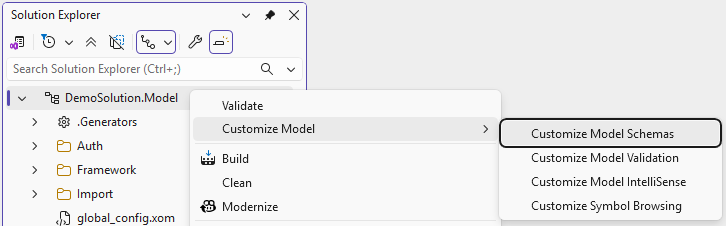
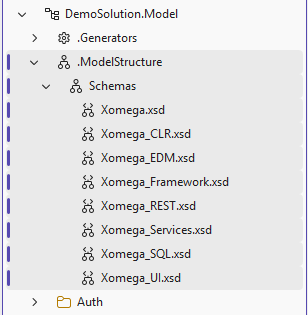
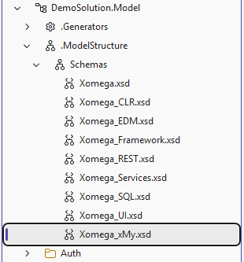

# Extending model structure

Xomega model is designed to be easily extended and customized to allow you to enhance existing model elements with additional properties for your specific needs, or define completely new elements for model concepts that are not covered by the existing model. This can be used to support new technologies or frameworks, or to generate additional types of artifacts from the model.

You can use the new properties and elements in your custom code generators, or even in the existing generators by customizing them to recognize those new properties and elements.

:::note
Extending the model and customizing generators requires the **Full license** of the Xomega.Net for Visual Studio.
:::

## Customizing model schemas

The default structure of the model is defined by a set of XML schemas, which are packaged with the Xomega SDK. Xomega uses those schemas to validate the model and to provide IntelliSense support in the XML editor, but it needs all model schemas to be in the same directory.

Therefore, to provide custom schemas for your model, you'd need to copy the default schemas to a custom directory, so that you could add your custom schemas there. You can do it easily by right-clicking on the model project in the Solution Explorer and selecting the *Customize Model > Customize Model Schemas* menu, as shown in the following screenshot.



This will create a new folder `.ModelStructure\Schemas` in your model project and copy all default schemas that are currently used in your model to that folder, as shown below.



Each `.xsd` file defines a schema that targets a specific namespace, which is used to describe a specific aspect of the model. For example, `Xomega.xsd` defines the core model structure with the default namespace, while `Xomega_Services.xsd` defines service layer configurations with a namespace prefix `svc:`. You can learn more about the standard set of schemas in the [Model Structure](../modeling/overview#schemas-and-namespaces) documentation.

:::note
The *Customize Model Schemas* menu will only copy the schemas that are currently used in your model. For example, the above screenshot does not include the `Xomega_WCF.xsd` for configuring legacy WCF services that are not used in the current solution. If you later add new elements from other Xomega schemas, you can select the *Customize Model Schemas* menu again to copy those new schemas to your custom directory.
:::

### Updating custom schemas on upgrade

When you upgrade to a new version of the Xomega SDK that includes updated schemas, you may want to update your custom model schemas to the latest versions. For that, you will need to delete the **original** `Xomega*.xsd` files from your custom schemas directory, and then select the *Customize Model Schemas* menu again to copy the latest versions of the default schemas to your custom directory.

:::note
If you have made any **customizations to the default schemas**, you will **need to merge** those customizations into the latest versions of the default schemas. If you keep the customized versions of the default schemas in source control, you will be able to easily compare the old and new versions of the schemas and merge your customizations into the new versions.
:::

### Customizing model schemas directory

If you want to use a different directory for your custom schemas, you can change the `CustomModelSchemasDir` property and the corresponding `Include` in your model project file, as shown in the following snippet.

```xml title="DemoSolution.Model.xomproj"
<Project Sdk="Xomega.Sdk/10.0.1">
  ...
  <PropertyGroup>
<!-- removed-next-line -->
    <CustomModelSchemasDir>$(MSBuildProjectDirectory)\.ModelStructure\Schemas</CustomModelSchemasDir>
<!-- added-next-line -->
    <CustomModelSchemasDir>$(MSBuildProjectDirectory)\.MyModelSchemas</CustomModelSchemasDir>
  </PropertyGroup>
  ...
  <ItemGroup>
<!-- removed-next-line -->
    <Template Include=".ModelStructure\Schemas\*.xsd" />
<!-- added-next-line -->
    <Template Include=".MyModelSchemas\*.xsd" />
  </ItemGroup>
</Project>
```

## Adding new model elements

You can extend the model by adding custom elements to various [default extension points](#standard-model-extension-points). The new elements must be defined for your custom namespace in a new schema file. To do that, you need to create a new `.xsd` file named such that it goes after all default schemas, for example `Xomega_xMy.xsd`, and add it to your custom schemas directory as illustrated below.



In your custom schema, you need to declare your custom target namespace, such as `http://www.mydomain.net/xomega`, and import the default Xomega schema(s) that you want to extend, as shown in the following snippet.

```xml title="Xomega_xMy.xsd"
<!-- highlight-start -->
<xs:schema targetNamespace="http://www.mydomain.net/xomega" xmlns="http://www.mydomain.net/xomega"
<!-- highlight-end -->
           xmlns:o="http://www.xomega.net/omodel"
           xmlns:xs="http://www.w3.org/2001/XMLSchema"
           elementFormDefault="qualified" attributeFormDefault="unqualified" version="1.0">
<!-- highlight-next-line -->
  <xs:import namespace="http://www.xomega.net/omodel" schemaLocation="Xomega.xsd"/>
</xs:schema>
```

If you want to extend other schemas that provide [additional extension points](#xomega-framework-extension-points), such as `Xomega_Framework.xsd`, you will need to import those schemas as well.

:::warning
To avoid schema errors, the `.xsd` file for your custom schema **must go after the imported schema files**. Therefore, it's best to name it such that it goes after all default schemas in the directory, hence the odd name `Xomega_xMy.xsd` in the above example.
:::

### Adding type extensions

You can extend logical types defined in the model to associate additional custom information with those types. This will allow you to use that information in your custom code generators for any field or parameter that is based on that type, or even in the existing generators by customizing them to recognize those new properties.

:::note
Typically, if a logical type does not explicitly specify certain configuration properties, those properties will be **inherited from the base type**, so you'll need to make sure to add this logic to your custom generators.
:::

To provide type extensions, you need to define a new element in your custom schema that uses substitution group `o:type-extension` and extends the `o:typeConfigurationExtension` base type, as shown in the following snippet.

```xml title="Xomega_xMy.xsd"
<xs:schema targetNamespace="http://www.mydomain.net/xomega" ...>
<!-- highlight-next-line -->
  <xs:element name="type-ext" substitutionGroup="o:type-extension">
    <xs:complexType>
      <xs:complexContent>
<!-- highlight-next-line -->
        <xs:extension base="o:typeConfigurationExtension">
          <xs:attribute name="type-attr" type="xs:string"/>
        </xs:extension>
      </xs:complexContent>
    </xs:complexType>
  </xs:element>
</xs:schema>
```

This will allow you to add the `my:type-ext` element directly to the `config` section of any logical type in your model, as follows.

```xml title="person.xom"
<types>
  <type name="person" base="business entity">
    <config>
<!-- highlight-start -->
      <my:type-ext type-attr="type value"
                   xmlns:my="http://www.mydomain.net/xomega"/>
<!-- highlight-end -->
    </config>
  </type>
</types>
```

Xomega model also allows you to provide your type extensions in a separate file under the `type-config` elements for each type, as opposed to mixing them with each type definition. This allows you to easily review all type extensions in one place, and add or remove them without having to modify the original type definitions. The following snippet illustrates how to add type extensions in a separate `my_extension.xom` file.

```xml title="Framework/TypeConfigs/my_extension.xom"
<types>
  <type-config type="person">
<!-- highlight-start -->
    <my:type-ext type-attr="type value"
                 xmlns:my="http://www.mydomain.net/xomega"/>
<!-- highlight-end -->
</types>
```

:::note
The generators that will use your type extensions will need to recognize both the `type/config` and `type-config` sections.
:::

### Adding element extensions

Many base Xomega model elements provide [standard extension points](#base-xomega-model-extension-points) under their `config` sections, which allow you to add custom properties to those elements. These extension points are also used by other default Xomega schemas, such as `Xomega_SQL.xsd` for database configuration.

To provide a custom extension for a specific model element, you need to define a new element in your custom schema that uses the corresponding substitution group and extends the corresponding base type. For example, to add an extension for object configurations, you would define a new element that uses substitution group `o:object-extension` and extends the `o:objectConfigurationExtension` base type, as shown in the following snippet.

```xml title="Xomega_xMy.xsd"
<xs:schema targetNamespace="http://www.mydomain.net/xomega" ...>
<!-- highlight-next-line -->
  <xs:element name="obj-ext" substitutionGroup="o:object-extension">
    <xs:complexType>
      <xs:complexContent>
        <xs:extension base="o:objectConfigurationExtension">
<!-- highlight-next-line -->
          <xs:attribute name="obj-attr" type="xs:string"/>
        </xs:extension>
      </xs:complexContent>
    </xs:complexType>
  </xs:element>
</xs:schema>
```

Once you have defined your custom extension element, you can add it to the `config` section of any object in your model under your custom namespace and prefix, as illustrated below.

```xml title="person.xom"
  <object name="person">
    <fields>[...]
    <config>
      <sql:table name="Person.Person">[...]
<!-- highlight-start -->
      <my:obj-ext obj-attr="some value"
                  xmlns:my="http://www.mydomain.net/xomega"/>
<!-- highlight-end -->
    </config>
    <doc>[...]
  </object>
```

For the full list of available extension points, see the [Standard model extension points](#standard-model-extension-points) section below.

### Adding new entity types

In addition to extending existing model elements, you can also add completely new elements to the model to represent concepts that are not covered by the existing model. Such new elements are usually specified under the `module` element using a grouping element that holds a collection of your custom entities.

The following snippet illustrates how to add a new grouping element `my:entities` with a collection of `my:entity` elements with a `name` attribute under the `module` element.

```xml title="Xomega_xMy.xsd"
<xs:schema targetNamespace="http://www.mydomain.net/xomega" ...>
<!-- highlight-next-line -->
  <xs:element name="entities" substitutionGroup="o:module-entities">
    <xs:complexType>
      <xs:complexContent>
<!-- highlight-next-line -->
        <xs:extension base="o:moduleEntities">
          <xs:sequence>
            <xs:element name="entity" maxOccurs="unbounded">
              <xs:complexType>
                <xs:attribute name="name" type="xs:string"/>
              </xs:complexType>
            </xs:element>
          </xs:sequence>
        </xs:extension>
      </xs:complexContent>
    </xs:complexType>
  </xs:element>
</xs:schema>
```

This will allow you to add your custom entities `my:entity` under the `module` element in your model grouped by `my:entities`, as shown in the following snippet.

```xml title="person.xom"
<module xmlns="http://www.xomega.net/omodel"
<!-- highlight-next-line -->
        xmlns:my="http://www.mydomain.net/xomega"
        name="person">
  <objects>[...]
<!-- highlight-start -->
  <my:entities>
    <my:entity name="my entity"/>
  </my:entities>
<!-- highlight-end -->
</module>
```

### Adding global configurations

If you need to be able to specify some new configuration properties that should be available to multiple generators, you can define it as a custom global configuration element under the top-level `config` element in your model.

To do that, you need to define the parent element for your global configuration in your custom schema using substitution group `o:model-extension` and extending the `o:modelConfigurationExtension` base type, and add any attributes or elements you need, as shown in the following snippet.

```xml title="Xomega_xMy.xsd"
<xs:schema targetNamespace="http://www.mydomain.net/xomega" ...>
<!-- highlight-next-line -->
  <xs:element name="global-config" substitutionGroup="o:model-extension">
    <xs:complexType>
      <xs:complexContent>
<!-- highlight-next-line -->
        <xs:extension base="o:modelConfigurationExtension">
          <xs:attribute name="value" type="xs:string"/>
        </xs:extension>
      </xs:complexContent>
    </xs:complexType>
  </xs:element>
</xs:schema>
```

This will allow you to specify the `value` attribute of your custom global configuration element `my:global-config` under the top-level `config` element in your model, as illustrated below.

```xml title="global_config.xom"
<config xmlns="http://www.xomega.net/omodel"
<!-- highlight-next-line -->
        xmlns:my="http://www.mydomain.net/xomega">

<!-- highlight-next-line -->
  <my:global-config value="some value"/>
</config>
```

## Standard model extension points

Most of the Xomega model extension points are defined in the base Xomega model schema `Xomega.xsd`, but some additional extension points are also provided in other default schemas, such as `Xomega_Framework.xsd` for configurations tied to the Xomega Framework data objects.

### Base Xomega model extension points

The `Xomega.xsd` schema for the `http://www.xomega.net/omodel` namespace defines the following standard extension points for various model elements.

|Model elements|substitutionGroup|Base type|Description|
|-|-|-|-|
|`o:doc`|o:doc-extension|o:docExtension|Documentation extension.|
|`o:type`/`o:config`, `o:type-config`|o:type-extension|o:typeConfigurationExtension|Type configuration extension.|
|`o:enum`/`o:config`|o:enum-extension|o:enumConfigurationExtension|Enum configuration extension.|
|`o:field-set`/`o:config`|o:fieldset-extension|o:fieldsetConfigurationExtension|Fieldset configuration extension.|
|`o:object`/`o:config`|o:object-extension|o:objectConfigurationExtension|Object configuration extension.|
|`o:field`/`o:config`|o:field-extension|o:fieldConfigurationExtension|Field configuration extension.|
|`o:operation`/`o:config`|o:operation-extension|o:operationConfigurationExtension|Operation configuration extension.|
|`o:operation`/`o:input`/`o:config`, `o:operation`/`o:output`/`o:config`, `o:struct`/`o:config`|o:parameters-extension|o:parametersConfigurationExtension|Structure configuration extension.|
|`o:module`|o:module-entities|o:moduleEntities|New entities in a module.|
|`/o:config`|o:model-extension|o:modelConfigurationExtension|Global configuration extension.|

You can use the corresponding substitution groups and base types to create your custom extensions for the above model elements.

### Xomega Framework extension points

The `Xomega_Framework.xsd` schema for the `http://www.xomega.net/framework` namespace defines the following additional extension points for configuring the Xomega Framework data objects, which are mostly used by the `Xomega_UI.xsd` schema to add UI configuration for data objects.

|Model elements|substitutionGroup|Base type|Description|
|-|-|-|-|
|`xfk:data-object`|xfk:ui-display|xfk:uiDisplayConfiguration|UI Display configuration for data objects.|
|`xfk:data-object`|xfk:ui-link|xfk:uiLinkConfiguration|UI Link configurations for data objects.|
|`xfk:data-object`|xfk:ui-controls|xfk:uiControlsConfiguration|UI Controls configuration for data objects.|

If you need to add custom configuration for the `xfk:data-object` element in your model, you can also use one of the above substitution groups and base types to create your custom extension for that element.

## Configuring schema validation

Xomega provides an easy way to configure the severity of schema validation errors for different namespaces directly in the model project file. This allows you to specify whether validation issues for particular namespaces should be treated as warnings, errors, or ignored entirely, giving you finer control over how strict schema validation should be for different parts of your model.

If you extend the Xomega model with custom schemas and namespaces, you can specify that validation issues for your custom namespace should only be treated as warnings, while validation issues for the default Xomega namespaces should continue to be treated as errors.

You can configure this in your model project file by adding a `ModelSchemaValidationSeverity` property, where you specify the namespace regex patterns as keys and the desired severity (`warning`, `error`, or `none`) as values, as illustrated in the example below.

```xml title="DemoSolution.Model.xomproj"
<Project Sdk="Xomega.Sdk/10.0.1">
  <PropertyGroup Label="Globals">
    <ProjectGuid>{1D5A5684-F773-4004-8137-EB6067765CE4}</ProjectGuid>
    <Name>DemoSolution.Model</Name>
    <XomegaProjectType>Model</XomegaProjectType>
<!-- added-lines-start -->
    <ModelSchemaValidationSeverity>
      http://www.mydomain.net/xomega = warning;
      http://www.xomega.net/.* = error;
    </ModelSchemaValidationSeverity>
<!-- added-lines-end -->
  </PropertyGroup>
</Project>
```

Xomega will apply the specified rules in the order they are listed in the property, matching the namespace patterns against the namespaces of the elements being validated. Therefore, you want to list the more specific namespace patterns first, followed by the more general default patterns.

:::note
This severity configuration applies only to **schema validation** performed **during the model build** that runs Xomega generators, and allows you to suppress certain schema validation errors to enable running the generators. The Xomega model editor may still show those validation issues as errors in VS, but they will not prevent the generators from running when building the model.
:::