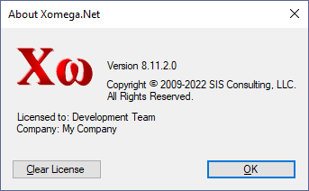

# Installation and Activation

Installing and activating Xomega.Net is a simple process that helps you get started fast, as described below.

## Installing Xomega.Net

You can download and install Xomega.Net for Visual Studio as a standalone signed `.msi` package using the following simple steps.
1. [Download Xomega.Net](https://xomega.net/System/Download.aspx) for your version of Visual Studio.
1. Make sure that your Visual Studio is not running.
1. Run the downloaded `.msi` package to start the installation. The package should be signed by *SIS Consulting, LLC*, so you can accept any warnings regarding 3rd party software that your system may present.
1. Accept the Xomega.Net license agreement.
1. Use default installation configuration (recommended) or specify any custom parameters in the installation wizard.
1. Launch your Visual Studio and check the *Help > About* dialog. It should have Xomega.Net listed as one of the installed products, including the product version.

:::tip
Alternatively, you can open *Extensions > Manage Extensions* dialog, and check that Xomega.Net is one of the installed extensions.
:::

## Activating Xomega.Net

In order to use use Xomega.Net you need to [order a license](https://xomega.net/System/Order.aspx) for your version of Visual Studio. Once you order a license, you will receive an email with the license file(s) attached, which you will need to save to your local drive.

The first time you use Xomega.Net from your Visual Studio, it will ask you for the location of the license file. You will need to select the license file that you saved from your email. Once validated, it will be cached for the current version of Xomega.Net and Visual Studio, so that you won't need to supply it again.

In order to view the details of your current Xomega license, you can open (or create) any solution that has a Xomega model project, select that model project in the *Solution Explorer*, and then select the *Help > About Xomega.Net* menu option, which will bring up the following dialog.

If you need to clear the cached license, e.g. for updating to a new license, you can click the *Clear License* button. Then, next time you launch Visual Studio and use Xomega.Net, it will ask you to supply a new license.

:::info
If you get any errors when clearing the license, try running the Visual Studio under an administrator's account.
:::

## System Requirements

For building modern Blazor apps, Xomega.Net requires the following components to be installed:

- Windows 10 or higher
- Visual Studio 2019 Community or higher
- .NET 5

For building legacy .NET applications, you may also use the following components (not recommended):

- Windows 7 or higher
- Visual Studio 2017 Community or higher
- .NET Framework 4.5 or higher

To view the notices for licensed third-party software components included within Xomega.Net [click here](third-party).