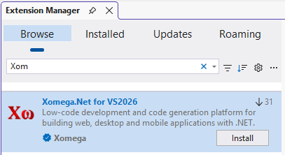
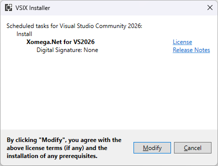
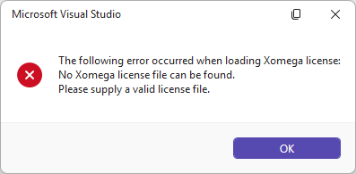
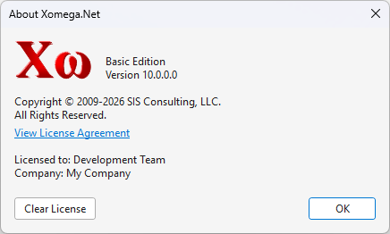

# Installation and Activation

*Xomega.Net for VS2026* is available as a Visual Studio extension, and is cleanly installed per-user as a VSIX package in a single user-specific folder, without affecting other users or modifying any common Visual Studio installation folders or system folders like GAC.

This allows for a very simple installation and uninstallation process, without requiring administrator privileges, and also allows for automatic updates through the Visual Studio Marketplace.

## System Requirements

For building modern Blazor, WPF or MAUI apps, Xomega.Net requires the following components to be installed:

- **Windows 11** or higher
- **Visual Studio 2026** Community or higher
- **.NET 10** SDK or higher
- [**Npgsql PostgreSQL Integration**](https://marketplace.visualstudio.com/items?itemName=RojanskyS.NpgsqlPostgreSQLIntegration) extension, if you want to use PostgreSQL as your database.

:::note
You can also install *Xomega.Net for VS 2026* extension in **Visual Studio 2022** and even run it on Windows 10, but you will need either .NET 8 or 9, and you won't be able to use the latest .NET 10 SDK.
:::

For building legacy .NET applications, you also need .NET Framework 4.7.2 or higher.

## Installing Xomega.Net

The easiest way to install Xomega.Net is through the Visual Studio Extension Manager, which allows you to search for and install the latest version of Xomega.Net directly from the Visual Studio Marketplace.

Open Visual Studio 2026 and select *Extensions > Manage Extensions...* menu to open the Extension Manager window. Then, select the *Browse* tab, and search for "Xomega.Net". You should see the *Xomega.Net for VS2026* extension in the search results as shown below.

Click *Install* on the *Xomega.Net for VS2026* extension and then close Visual Studio to start the installation automatically.

:::tip
Alternatively, you can download the latest Xomega.Net VSIX package from the [Visual Studio Marketplace](https://marketplace.visualstudio.com/items?itemName=Xomega.XomegaNetVS2026) and install it by double-clicking the downloaded VSIX file.
:::

After closing Visual Studio, you should see the VSIX Installer window as shown below.

You can click the *License* link to view the Xomega.Net license agreement or the *Release Notes* link to view the release notes for the version you are installing. Click *Modify* to start the installation, which should complete in a few seconds.

Once the installation is complete, you can launch Visual Studio 2026 and check that *Xomega.Net for VS2026* extension is listed in the Extension Manager under the *Installed* tab.

## Activating Xomega.Net

To use Xomega.Net you need to [order a license](https://xomega.net/product/pricing). Once you order a license, you will get a link that allows you to download the license file(s), which you will need to save to your local drive. You will also receive an email with the same link and instructions on how to activate your license.

When you first try to use Xomega.Net in Visual Studio, e.g. by [creating a new Xomega solution](../new-projects/new-solutions) or by opening an existing one that contains a [Xomega model project](../model-project/project-structure), you will get the following error message if you haven't activated your license yet.

Once you click *OK* on the error message, you will get a file selection dialog where you can select the license file that you saved earlier. Once validated, it will be cached for the current major version of Xomega.Net, so that you won't need to supply it again.

### Viewing the current license

To view the details of your current Xomega license, you can open (or create) any solution that has a Xomega model project, select that model project in the *Solution Explorer*, and then select the *Help > About Xomega.Net* menu option, which will bring up the following dialog.

Here you can see the details of your current license, including the licensee name, license type, and expiration date, as well as the version of Xomega.Net you are using. You can also click the *View License Agreement* link to open the license terms in RTF format.

If you need to clear the cached license, e.g. for updating to a new license, you can click the *Clear License* button. Then, the next time you launch Visual Studio and use Xomega.Net, it will ask you to supply a new license.

## Updating Xomega.Net

When a new version of Xomega.Net is released and published to the Visual Studio Marketplace, you will get a notification in Visual Studio through the Extension Manager, which will allow you to update to the latest version with a single click. You can also check for updates manually by opening the Extension Manager and selecting the *Updates* tab.

:::warning
Updating Xomega.Net extension to a new version **will not affect your existing Xomega solutions** and projects. You may need to **update them separately** by updating the version of Xomega SDK in your model projects, and by updating your projects to the latest versions of Xomega Framework NuGet packages.
:::

## Uninstalling Xomega.Net

If you need to uninstall Xomega.Net to completely remove it or to perform a clean reinstallation, you can do it through the Visual Studio Extension Manager. Open the Extension Manager and select the *Installed* tab, find the *Xomega.Net for VS2026* extension in the list, and click *Uninstall*. Then, close Visual Studio to complete the uninstallation process.

If you also want to clear the cached license, you can do it prior to uninstalling Xomega.Net from the *About Xomega* dialog as described above, or you can delete the `.lic` license file directly from the  file system at the following location: `%LOCALAPPDATA%\Xomega.Net`
