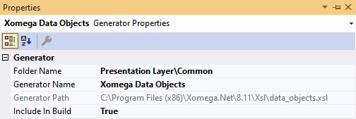
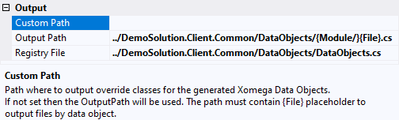
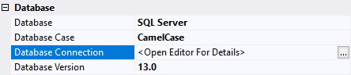
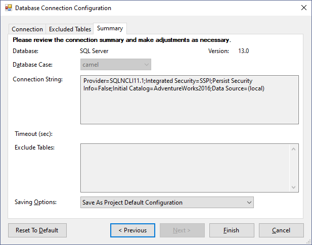
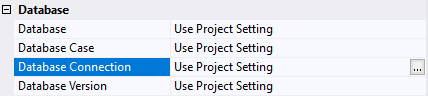

# Configuring Generators

You can configure generators either by setting generator parameters or by providing a global configuration in the model.

## Generator parameters

You can configure generator parameters in the *Properties* view for the selected generator. They are typically grouped into logical categories under the *Properties* tab. Let's review some typical parameter categories.

### Common parameters

All generators have a set of common parameters that include the `Generator Name`, `Folder Name` and whether or not it should be included in the build of the model project, as follows.



You can configure the folder as a path to the generator in the *Solution Explorer*, separated by backslash (\\). You can also change the name of the generator here, or you can rename it directly in the tree view by hitting F2.

:::note
The common parameters will also display the physical path to the generator's XSL stylesheet under the `Generator Path` parameter, which you won't be able to update through the *Properties* view.
:::

### Output paths

Most of the generators that output one or more files, when run, allow specifying relative paths for the target output, as illustrated below.



The relative paths oftentimes point to other projects in the solution, and allow specifying special placeholders like `{Module}` and `{File}`. This provides you with the maximum flexibility in how you want the generated code to be structured.

For instance, if you don't include any of these placeholders, the generated objects will be all output into the same file. This is how some generators used to do it, e.g. the *Entity Data Model*. While it may be convenient in some cases to keep all generated code in one file, that file could become quite large and hard to navigate, when you want to troubleshoot your app.

If you include just the `{Module}` placeholder, then the generator will create one file per module. This could still result in large generated files, but falls somewhere in the middle between a single file and individual files.

The recommended practice is to include both the `{Module}` and `{File}` placeholders to output generated code into individual files based on the context. The `{Module}` placeholder will allow you to group generated files by module in separate folders or using a naming convention (e.g. `{Module}_{File}`).

:::note
You can move the separator inside the braces, e.g. `{Module/}` to account for an empty module name, which would otherwise result in a double slash (//) in the path, and make the latter invalid.
:::

Based on your preferences and development standards, you can configure the generated files to be all completely isolated in a separate folder (e.g. with `Gen/{Module/}/{File}`), have them co-mingled with custom files, or a combination of the two, e.g. with `{Module/}Gen/{File}`, which will result in the generated files being isolated within each module. Each approach has its pros and cons.

:::tip
To check if a specific parameter allows any placeholders, you can view its description in the *Properties* window, as illustrated above for the `Custom Path` parameter, or you can check the [documentation](../../generators/overview.md) for that generator.
:::

### Database parameters

Some generators that require a connection to the database, e.g. to read the database structure or the actual data, will have a set of database related parameters, as shown below.



The `Database Connection` is edited via a separate dialog that allows specifying connection properties, as well as which tables to exclude from the model. It will also auto-populate other database parameters based on the properties of your database, but you can change them independently after that. The following picture illustrates the *Database Connection Configuration* dialog.



Since generators that need DB connection may need to share the same DB configuration, you can save these parameters as the project default, rather than for the specific generator, so that other generators could also use it. In this case the actual values from the first picture will be displayed on the properties of the *Model* project, while the properties of the generator will show the following.



## Creating multiple configurations

Xomega.Net allows you to clone any existing generator configuration, and save it as a new configuration under a different name. You can do it by selecting the generator in the project, pressing *Ctrl+C*, and then renaming the new generator as appropriate.

:::tip
You can always delete the cloned configuration later by pressing *Delete* on it.
:::

This is useful for flexible generators that support many different parameters, such as the [*Full CRUD with Views*](../../generators/model/crud.md) model enhancement generator, which adds specified elements, like operations or data objects and views, to your model.

With this generator, you can create configurations that add only a specific type of elements by turning everything off except for that one parameter. For example, you can have a generator that adds only REST methods to the operations.

You can also have a configuration of this generator that adds everything to the model at once, or you can create configurations for any combinations of the elements that you need to add as required.

:::info
The [documentation](../../generators/overview.md) of each generator typically specifies some common configurations, where applicable.
:::

## Global model configuration{#global}

The global model configuration is defined under the top-level `config` element in the model, and contains configuration that is available to all generators, so that it could be shared between multiple generators, where it cannot be specified as parameters of individual generators.

For example, generators of any classes that use the generated service contracts, such as data objects or service implementations, need to know the namespace for the service contracts, so it cannot be just a parameter of the *Service Contracts* generator. The following snippet illustrates this example.

```xml title="global_config.xom"
<config xmlns="http://www.xomega.net/omodel"
        xmlns:svc="http://www.xomega.net/svc">
  <svc:services-config async="true"
                       cancellation="true"
<!-- highlight-next-line -->
                       namespace="DemoSolution.Services.Common"
                       implNamespace="DemoSolution.Services.Entities"
                       tsOutputPath="../DemoSolution.Client.Spa/ServiceContracts/{Module/}{File}"/>
</config>
```

:::note
As you can see from the `tsOutputPath` attribute above, the output path for generated TypeScript objects can also be specified in the global configuration, rather than as individual generator parameters.

This is because the generated TypeScript files that use other generated TypeScript files need to know their exact location, in order to properly include them, unlike C# files that just need to know the namespace.
:::

The global model configuration also contains more complex elements that cannot be easily specified as simple generator parameters.

For example, a default configuration for Syncfusion Blazor grids to use in the generated views could look in the global configuration as shown below.

```xml title="global_config.xom"
<config xmlns="http://www.xomega.net/omodel">
  <!-- Syncfusion Blazor default controls configuration -->
  <blazor-controls-config xmlns="http://www.xomega.net/xsf">
<!-- highlight-start -->
    <XSfGrid AllowPaging="true" AllowReordering="true" AllowResizing="true"
             AllowSelection="true" AllowSorting="true" ShowColumnChooser="true" ShowColumnMenu="false">
      <XSfGridSelectionSettings PersistSelection="true"/>
      <GridSearchSettings IgnoreCase="true" />
      <GridPageSettings PageSizes="true" />
    </XSfGrid>
<!-- highlight-end -->
  </blazor-controls-config>
</config>
```
