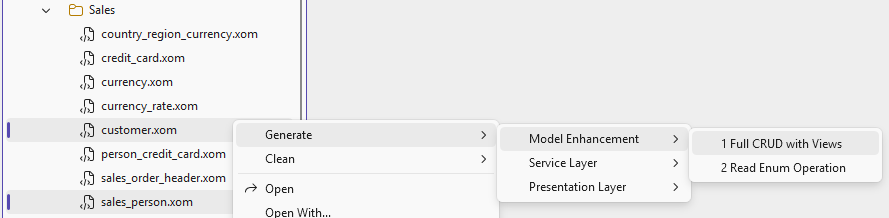
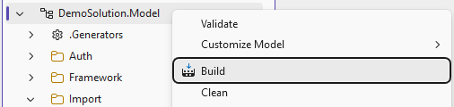
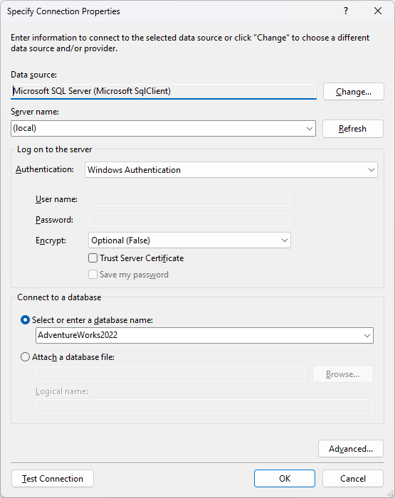
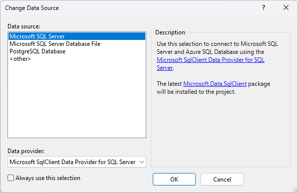
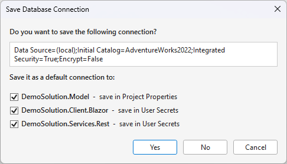
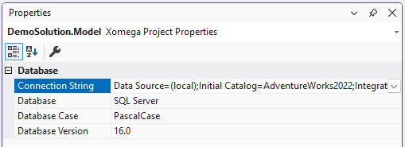
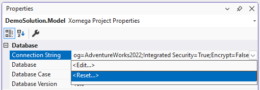

# Configuring Generators

Generators in Xomega model project are defined by specifying `.xgen` XML configuration files under the *.Generators* folder or its subfolders. Each generator configuration file specifies some common parameters on how the generator should be run, its capabilities and requirements, as well as additional configurations specific to that generator (or the class of generators it belongs to), which are used by that specific generator when it's being run.

However, some configurations need to be shared between multiple generators, allowing them to generate consistent parts of the application that would work together, without you having to duplicate the same configuration in multiple generator configuration files. Following are the two common ways to specify such shared configuration.

- [Global model configuration](../modeling/config#global-configuration) in the `global_config.xom` file.
- Model project properties, such as database properties, which are passed to the generators as parameters.

## Generator configuration

The following sections will cover the details of the generator configuration stored in the `.xgen` configuration files.

### Configuration schemas

The generator configuration `.xgen` files are XML files that have a common structure under the root `XomGeneratorConfig` element governed by the main XML schema for the default namespace `http://schemas.xomega.net/v10/xgen`.

More specific configurations for different classes of generators are defined in elements with their own prefixed namespaces, such as `xmlns:cls="http://schemas.xomega.net/v10/xgen/classes"`, which are governed by their own XML schemas.

The XML schemas for the generator configurations provide you IntelliSense in Visual Studio to help you with the available parameters and their descriptions and possible values, as well as to validate the configuration files during editing and when running the generators.

:::warning
When configuration schema applies to a specific class of generators, **not all parameters** defined in that schema may be **applicable to every generator** of that class, or parameter descriptions may be different for different generators. Such cases are typically noted in the comments in the configuration file itself, but you can also check the [documentation](../../generators/overview) for each specific generator to see which parameters are applicable to it and how they are used.
:::

:::tip
Typically, when a `bool` parameter is not specified in the configuration file, it is treated as `false`. Other types of parameters may also have default values when not specified, which are noted in the parameter descriptions in the documentation for each generator.
:::

### Common parameters

Common configuration parameters that apply to all generators are defined as attributes on the `Generator` element under the default namespace, as illustrated below.

```xml title="Xomega Data Objects.xgen"
<XomGeneratorConfig xmlns="http://schemas.xomega.net/v10/xgen"
                    xmlns:cls="http://schemas.xomega.net/v10/xgen/classes">

<!-- highlight-start -->
  <Generator Xsl="UI/Common/data_objects.xsl"
             GeneratorGroup="presentation"
             IndividualFiles="true"
             IncludeInBuild="true"/>
<!-- highlight-end -->
  ...
</XomGeneratorConfig>
```

Here are some of the most common parameters that you set on the `Generator` element.

#### XSL stylesheet

The most important parameter that must be set for each generator is the `Xsl` attribute, which specifies the path to the XSL stylesheet that implements the generator logic. This path is relative to a folder from Xomega SDK that stores XSL stylesheets for the generators, which is defined by the `GeneratorXslDir` property in the project file.

:::note
The Xomega SDK folder stores generators' XSL stylesheets in a binary format with a `.xsl.bin` extension, but you should still specify the path without the `.bin` extension.
:::

In the Full Edition, you can also specify a path to a custom root folder for the generator XSL stylesheets in the `CustomGeneratorXslDir` property of the project file. In this folder, you can place your custom XSL stylesheets for the generators or override the default ones from the SDK with your own versions. This property is configured automatically when you customize a generator by right-clicking on any generator configuration and selecting the *Customize Generator Sources* option.

#### Individual files

The `IndividualFiles` parameter specifies whether the generator can be run on one or more files, rather than on the entire model, by selecting the files in the model project, right-clicking on them, and selecting the generator from the *Generate* menu, as shown below.



The `GeneratorGroup` parameter allows you to specify which group the generator belongs to (`model`, `service`, or `presentation`), which is used for grouping such generators in the *Generate* context menu. For example, if you specify `presentation` as the group for a generator that can be run on individual files, it will be shown in the *Generate* menu under the *Presentation Layer* group.

#### Include in build

The `IncludeInBuild` boolean parameter specifies whether the generator should be run when you build the model project, as shown below. This allows you to run multiple generators together on the entire model at once, which is the most common use case for running generators, as it guarantees that all your model changes will be reflected in the regenerated artifacts.



Typically, you would want to include in the build all generators that produce artifacts for other projects in the solution, such as classes, views and resource files, that are needed for building those projects.

However, some generators are not meant to be run whenever you build the model project, but rather on demand for generating specific artifacts when you need them. This includes all *Model Enhancement* generators, which add certain elements to the model, [generators that require a database connection](#database-configuration), and generators that produce output that is not needed for building the solution, such as documentation, which you can generate when you need it, without slowing down the build of the model project.

### Output paths

Most of the generators that output one or more files, allow specifying a path for the target output relative to the project file, as illustrated below.

```xml
<XomGeneratorConfig xmlns="http://schemas.xomega.net/v10/xgen"
<!-- highlight-next-line -->
                    xmlns:cls="http://schemas.xomega.net/v10/xgen/classes">
  ...
<!-- highlight-next-line -->
  <cls:Output Path="../DemoSolution.Client.Common/DataObjects/{Module/}{File}.cs"
              RegistryFile="../DemoSolution.Client.Common/DataObjects/DataObjects.cs"/>

</XomGeneratorConfig>
```

The relative paths oftentimes point to other projects in the solution and allow specifying special placeholders like `{Module}` and `{File}`. This provides you with the maximum flexibility in how you want the generated code to be structured.

For instance, if you don't include any of these placeholders, the generated objects will be all output into a single file. While it may be convenient in some cases to keep all generated code in one file, that file could become quite large and hard to navigate, when you want to troubleshoot your app.

If you include just the `{Module}` placeholder, then the generator will create one file per module. This could still result in large generated files but falls somewhere in the middle between a single file and individual files.

The recommended practice is to include both the `{Module}` and `{File}` placeholders to output generated code into individual files based on the context. The `{Module}` placeholder will allow you to group generated files by module in separate folders or using a naming convention (e.g. `{Module}_{File}`).

:::note
You can move the separator inside the braces, e.g. `{Module/}` to account for an empty module name, which would otherwise result in a double slash (//) in the path, and make the latter invalid.
:::

Based on your preferences and development standards, you can configure the generated files to be all completely isolated in a separate folder (e.g. with `Gen/{Module/}/{File}`), have them co-mingled with custom files, or a combination of the two, e.g. with `{Module/}Gen/{File}`, which will result in the generated files being isolated within each module. Each approach has its pros and cons.

:::tip
To check if a specific parameter allows any placeholders, you can hover over it to see the description tooltip, or you can check the [documentation](../../generators/overview) for that generator.
:::

Not all generators need or use the output path parameters, and different generators may need different paths specified, which is why the `Output` elements are defined in separate XML namespaces for different classes of generators, such as `cls:Output` for the class of generators that produce code files, and `doc:Output` for the class of generators that produce documentation files.

:::note
Often, generators that produce TypeScript classes have their output paths defined in the global model configuration to allow other generators to use those paths when generating TypeScript files that need to import those generated classes.
:::

### Multiple configurations

In the model project, you can have multiple configurations of the same generator, which allows you to generate different artifacts with different parameters using the same generator logic.

:::tip
The easiest way to create a new configuration of an existing generator is to clone the existing configuration, rename it, and change the parameters as needed.
:::

This is useful for flexible generators that support many different parameters, such as the [*Full CRUD with Views*](../../generators/model/crud) model enhancement generator, which adds specified elements, like operations or data objects and views, to your model.

With this generator, you can create configurations that add only a specific type of element by turning everything off except for that one parameter. For example, you can have a generator that adds only REST methods to the operations.

You can also have a configuration of this generator that adds everything to the model at once, or you can create configurations for any combinations of the elements that you need to add as required.

:::info
The [documentation](../../generators/overview) of each generator typically specifies some common configurations, where applicable.
:::

## Database configuration

Some generators require a connection to the database to read the database structure, such as for the [*Import from Database*](../../generators/model/import) or [*Database Change Script*](../../generators/data/migration) generators, or to read the actual data, such as for the [*Enumerations from Database*](../../generators/model/enums) and [*Custom SqlXml Report*](../../generators/docs/sqlxml) generators. For such generators, you need to set `DbSchemaNeeded` or `DbConnectionNeeded` parameters on the generator configuration respectively, as illustrated below.

```xml title="Import from Database.xgen"
<XomGeneratorConfig xmlns="http://schemas.xomega.net/v10/xgen"
                    xmlns:dbi="http://schemas.xomega.net/v10/xgen/db-import">

  <Generator Xsl="Model/import_from_db.xsl"
<!-- highlight-next-line -->
             DbSchemaNeeded="true"
             DbTimeout="30"/>

</XomGeneratorConfig>
```

When `DbSchemaNeeded` parameter is specified, Xomega will read the database structure in XML format and pass it to the generator as a parameter. When `DbConnectionNeeded` is specified, Xomega will pass the database connection string to the generator, so that it can read the data from the database as a string using the `xom:GetQueryData` extension function in the XSL stylesheet as follows.

```xml
<xsl:variable name="data" select="xom:GetQueryData($DbProvider, $DbConnection, $SqlQuery, $timeout)"
              xmlns:xom="clitype:Xomega.Generator.GenEngine?asm=Xomega.Generator"/>
```

If querying the database to get the database schema or data takes a long time, you can specify the `DbTimeout` parameter in seconds to set the timeout for the database connection.

:::note
Generally, the generators that require a database connection should not be [included in the build](#include-in-build), since they are not meant to be run whenever you build the model project.
:::

### Configuring connection info

When you run a generator that requires a database connection and there is no default connection saved for the model project, you will be prompted to specify the database connection parameters, as shown below.



The data source will use the default data provider for the current database, which is set initially under the *Service Layer > Business Services Implementations* section when [creating the Xomega solution](../new-projects/new-solutions#reviewing-solution-configuration). If you want to change the data source to a different one for your database, e.g. to use *Microsoft SQL Server Database File* instead of the server, you can click the *Change* button and select it in the following dialog.



:::warning
If you switch to a completely **different database system**, such as from SQL Server to PostgreSQL, you may need to perform many more **additional updates** in your solution, such as adding sql types mappings for the new database in the model project, updating NuGet packages for the new database and changing the initialization code in the startup projects.
:::

:::note
To enable the `PostgreSQL Database` data source you need to install VS extension [*Npgsql PostgreSQL Integration*](https://marketplace.visualstudio.com/items?itemName=RojanskyS.NpgsqlPostgreSQLIntegration).
:::

### Saving database config as default

If you were prompted to specify the database connection information when running a generator, you will next be asked if you want to save it as default for the model project, as well as to use it for the startup projects of your application, as shown below.



If you choose to save the connection info as default for the model project, it will update the [database parameters](#database-parameters), such as `Database`, `DbVersion` and `DbCase` in the project properties, and store connection information (with sensitive data encrypted) in the `.user` file for the model project, so that you can exclude it from source control.

Once saved, the default connection info will be used for all subsequent runs of generators that require a database connection, and you won't be prompted to specify it again, unless you [reset or change it](#editingresetting-connection-info) in the project properties.

Saving the connection info for the startup projects is a convenient option to configure your application for working with the database when you import the model from the database for the first time. The connection info for the startup projects is stored in their respective user secrets, which is a secure way to store sensitive data in development without risking it being checked into source control.

:::tip
You can always update connection info for startup projects stored in user secrets by right-clicking on the startup project, selecting *Manage User Secrets*, and updating the connection info in the opened `secrets.json` file.
:::

### Managing default connection info

You can view and edit the default database configuration for the model project in the project properties panel or dialog, as shown below.



#### Database parameters

Default parameters `Database`, `Database Version` and `Database Case` are passed to the generators and can be edited either in the project properties panel or in the project file directly as follows.

```xml title="DemoSolution.Model.xomproj"
  <PropertyGroup Label="Database">
<!-- highlight-start -->
    <Database>sqlsrv</Database>
    <DbVersion>16.0</DbVersion>
    <DbCase>pascal</DbCase>
<!-- highlight-end -->
  </PropertyGroup>
```

The `Database` parameter specifies the type of database, such as `sqlsrv` for Microsoft SQL Server or `postgres` for PostgreSQL, and is set initially when you [create the Xomega solution](../new-projects/new-solutions#reviewing-solution-configuration). It is used by the generators to find the appropriate mappings between logical and physical database types. As mentioned above, changing the database type may require additional updates in your solution, so you should do it with caution.

The `DbVersion` parameter specifies the major and minor version of the database, and is set initially when you save the default connection info for the model project. It is used by some generators to determine which features or types are supported by the current database version when generating the output.

The `DbCase` parameter specifies the case convention for the database object names, such as `pascal` for PascalCase or `upper` for UPPER_SNAKE case, and is set initially when you save the default connection info for the model project by inspecting the database object names. It is used by some generators to determine how to generate the database object names from the model names when no specific database name is provided for that element.

#### Editing/resetting connection info

You can edit or reset the default connection info for the model project by selecting the `<Edit...>` or `<Reset...>` options from the dropdown for the *Connection String* parameter in the project properties, as shown below.



Editing the connection info will open the same [*Specify Connection Properties*](#configuring-connection-info) dialog as when you run a generator that requires a database connection, except that it will be pre-populated with the current default connection info, and you will not be prompted to save it as default after you edit it.

Resetting the connection info will clear the default connection info for the model project, so that you will be prompted to specify it again when you run a generator that requires a database connection.

## Global model configuration{#global}

The global model configuration is defined under the top-level `config` element in the model and contains configuration that is available to all generators so that it could be shared between multiple generators, where it cannot be specified as parameters of individual generators.

:::tip
You can view detailed documentation on the global configuration [here](../modeling/config). To see how it is used by individual generators, you can also check the [documentation](../../generators/overview) on each specific generator.
:::
