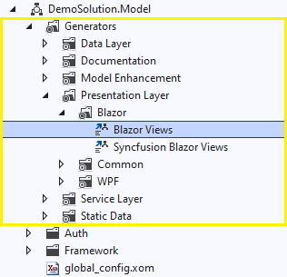
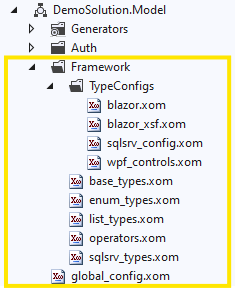
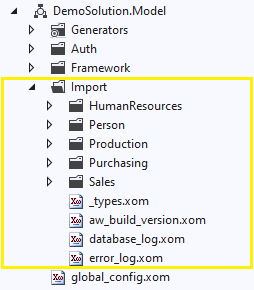

# Model Project Structure

The Xomega model project consists of the generators organized into folders, framework files, global configuration, and the actual application model files, as described below.

## Xomega generators

Xomega generators are grouped under a special *Generators* node in the Xomega project and are further organized into folders by their layer or type of output, as well as by technology, where applicable, as illustrated below.

The Xomega project initially contains all generators for all supported technologies, even if you haven't selected them in the solution configuration wizard. However, only the relevant generators will be included in the build of the model project.

:::tip
You can easily delete irrelevant generators from the model project if you are not planning to support those technologies in your application.
:::

The reason why those generators are included initially is that it's **much easier to delete** them if you don't need them **than to add them back** if you decide that you do need them.

:::info
You can also easily change the default folder structure for the generators to the one that makes more sense for your application.
:::

## Framework and global config

In addition to the generators, the initial model project will include some framework base types with their configurations, as well as a global model configuration file, as shown below.

Configuration of the base types is also broken down by technology, which is stored in separate files under the *TypeConfigs* folder.

:::tip
As with the generators, you can just delete type configs for technologies that you don't need, as it would be much easier than adding those back.
:::

The global model configuration is defined by default in the `global_config.xom` file. You can read about the details of the global configuration in the [next section](configuring-generators#global).

:::info
The default global configuration will also have settings for all technologies, which you can easily delete if you don't need those.
:::

## Application model files

The main elements of the model project will be the model files for your application. Typically, you want to define groups of closely related model elements, such as for a specific domain object, in separate files, and also organize them by application modules, as illustrated below.

If you are building your application from scratch, then you can add new model files using the *Add > New Item...* command.

If you have an existing database, then you can import your objects from a SQL Server database.

:::note
By default, the *Import from Database* generator outputs the model files into a separate folder *Import*, so that you could review it, and easily delete it if you need to update something and re-run the generator. You can change the output path for the final run of that generator as appropriate.
:::

:::tip
If your existing database is not SQL Server, you can still leverage the *Import from Database* generator. You just need to export a DDL script for your DB structure using your database tools, run it against an empty SQL Server database, and then import the objects from that database.
:::

For further details on importing the model from a database please check the description of the [*Import from Database*](../../generators/model/import) generator, as well as the [step-by-step tutorial](../../tutorial/1-basic/2-import).