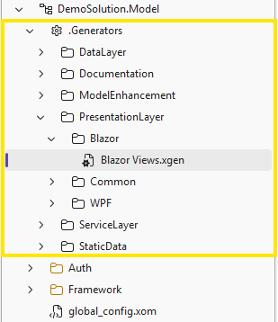
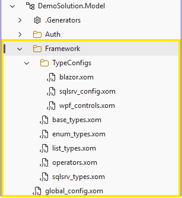
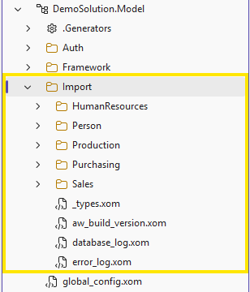

# Model Project Structure

The Xomega model project consists of Xomega SDK, generator configurations organized into folders, framework files, global configuration, and the actual application model files, as described below.

## Xomega SDK

The Xomega model project uses modern SDK-style project format, which means that you can view and edit the project file directly in Visual Studio, and it will automatically include all the files in the project folder and subfolders.

The default project properties, XML schemas and everything necessary to run the generators, including build tasks and targets, as well as the actual XSL transformation scripts for the generators, are included in the Xomega SDK, which is a NuGet package referenced by the model project's `Sdk` attribute using its name and version, as shown below.

```xml title="DemoSolution.Model"
<!-- highlight-next-line -->
<Project Sdk="Xomega.Sdk/10.0.1">
  <PropertyGroup Label="Globals">
    <ProjectGuid>{78ED4ADE-D340-43C4-A090-602BBE847CC1}</ProjectGuid>
    <Name>DemoSolution.Model</Name>
    <XomegaProjectType>Model</XomegaProjectType>
  </PropertyGroup>
  <PropertyGroup Label="Database">
    <Database>sqlsrv</Database>
    <DbVersion>16.0</DbVersion>
    <DbCase>pascal</DbCase>
  </PropertyGroup>
</Project>
```

SDK-style model project allows for a very simple and clean project file, where you can easily add any additional properties or override the default ones defined in the SDK.

:::tip
Referencing Xomega SDK by version allows you to **easily update to the latest SDK version** on any existing model project by simply changing the version number in the `Sdk` attribute, which will give you access to the latest schemas and generator scripts, as long as there are no breaking changes in the new version.
:::


## Xomega generators

Xomega generator configurations are grouped under a special *.Generators* folder in the Xomega project and are further organized into folders by their layer or type of output, as well as by technology, where applicable, as illustrated below.



You are free to change the default folder structure for the generators to the one that makes more sense for your application, or delete irrelevant generators from the model project if you don't need them.

You can also [add new generators](../new-projects/adding-to-solution#adding-wpf-views-generator) or [clone and update existing configurations](configuring-generators#multiple-configurations).

### Customizing Generators node

You can change the default top-level folder name for the generators from *.Generators* to something else, such as *.MyGenerators*, by renaming it and overriding the `GeneratorsDir` property and `Include` paths in the project file as illustrated below.
```xml
<PropertyGroup>
  <GeneratorsDir>$(MSBuildProjectDirectory)\.MyGenerators</GeneratorsDir>
</PropertyGroup>
<ItemGroup>
  <Template Include=".MyGenerators\**\*.docx" />
  <XomGenerator Include=".MyGenerators\**\*.xgen" />
</ItemGroup>
```

## Framework and global config

In addition to the generators, the initial model project will include some framework base types with their configurations, including database-specific types, as well as a global model configuration file, as shown below.



Configuration of the base types is also broken down by technology, which is stored in separate files under the *TypeConfigs* folder.

The global model configuration is defined by default in the `global_config.xom` file. You can read about the details of the global configuration in the [next section](configuring-generators#global).

## Application model files

The main elements of the model project will be the model files for your application. Typically, you want to define groups of closely related model elements, such as for a specific domain object, in separate files, and also organize them in folders by application modules, as illustrated below.



If you are building your application from scratch, then you can add new model files using the *Add > New Item...* command.

If you have an existing database, then you can import your objects from your database by using the *Import from Database* generator.

:::note
By default, the *Import from Database* generator outputs the model files into a separate folder *Import*, so that you could review it, and easily delete it if you need to update something and re-run the generator. You can change the output path for the final run of that generator as appropriate.
:::

:::tip
If your existing database is not supported, you can still leverage the *Import from Database* generator. You just need to export a DDL script for your DB structure using your database tools, run it against an empty SQL Server or PostgreSQL database, and then import the objects from that database.
:::

For further details on importing the model from a database please check the description of the [*Import from Database*](../../generators/model/import) generator, as well as the [step-by-step tutorial](../../tutorial/basic/import).