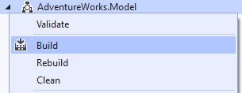
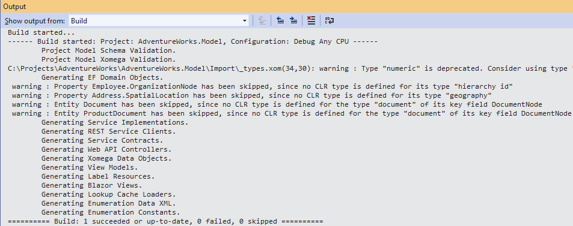
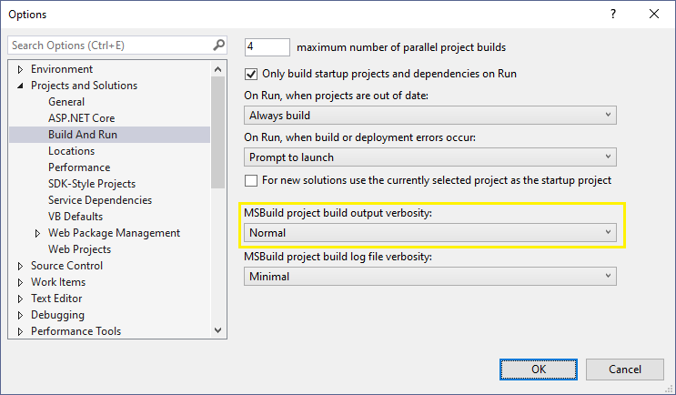
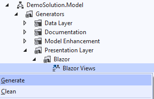
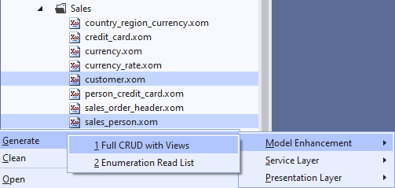

# Running Generators

Xomega.Net provides multiple ways to run a single or multiple generators based on the changes you have made, and depending on the generators.

## Running multiple generators

The most common generation use case is to run multiple generators on the entire model at once, in order to regenerate everything that you need from your model. This process may take longer, but it guarantees that all your model changes will be reflected in the regenerated artifacts.

To configure the generators that should be run together, you need to set the `Include In Build` parameter to `True` for those generators, as illustrated below.

Now, to run those generators, you just need to right-click on your `.Model` project in the *Solution Explorer*, and select the `Build` option, as follows.

:::caution
By default, the `.Model` project will not be built when you build your solution, since running multiple generators can take some time, and you want to do it only after you change something in the model itself, and not whenever you build your solution. That's why you need to build the model project explicitly through the context menu.
:::

## Viewing logs from the generation

The output console for the Build will print the generators being run and any warnings or other output from the generators as shown below.

If, for debugging purposes, you also want to see the specific files that were generated or updated during the generation, you can set the output verbosity to `Normal` in the *Build and Run* options of Visual Studio, as follows.

## Running a single generator

If you want to run a single generator on the entire model, you can select the *Generate* option when you right-click on that generator (or also from the top-level *Project* menu), as follows.

:::tip
Some generators, such as *Blazor Views*, have a selector parameter, where you can specify a single view that you want to generate. So, you can create a configuration of such a generator for a specific single view, and then run it for that view only.
:::

## Running a generator on select files

If you are working on a specific file or a set of files, you can run a certain generator only for the selected files. To do that, you can you can select multiple `.xom` files in the model project, right click on them, and select the generator from the *Generate* menu, as shown below.

This can be useful when you are working on a specific object, and would like to regenerate something only for the selected object. But the most common use case is to run one of the *Model Enhancement* generators that would add or remove certain model elements to/from the selected files.

:::note
Not all generators support being run on selected files. Some generators must be run on the entire model.

Conversely, some generators, such as *Full CRUD with Views*, **must** be run on selected files only, since it doesn't make sense to run them on all objects.
:::

## Cleaning generator output

In addition to generating artifacts, Xomega.Net also allows you to clean the generated artifacts, where possible. In order to do that, you need to select the *Clean* menu option on the `.Model` project, on a specific generator, or on the selected files.

:::danger
The *Clean* option will **delete** all generated files, and any **mixed in customizations**.

When adding mixed-in customizations, you can preserve them to survive a *Clean* operation by deleting a certain line in the generated header of the file, as instructed in the header text, or by configuring a `preserve-on-clean` attribute in the model. Please check the documentation on the corresponding generator for more details.
:::

Cleaning is useful when you are renaming model entities in such a way, that it affects the names of the generated files, and you need to clean up the old files.

If a generator adds something to a file, such as new model elements in the *Full CRUD with Views* generator, then the *Clean* operation should remove the added elements.

:::caution
Not all generators support cleaning the generated output. Please check the documentation on the corresponding generator.
:::

:::tip
Always check in your files to your source control first to avoid losing your customization accidentally.
:::