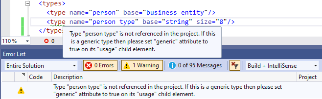
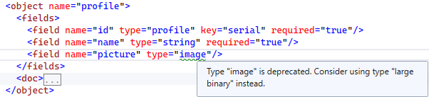

# Logical Types

Logical types are defined under the `types` element of the `module`, and constitute one of the core elements of the Xomega modeling, allowing you to freely model your application on the logical level without being restricted by any physical types of any specific technology or platform. This, in turn, helps you make your application consistent across all layers, and therefore easy to learn and maintain.

The logical types do eventually map to specific physical types in various layers, in order to allow Xomega to generate an actual application for you, but you should always try to define your logical types on conceptual level for your domain model, rather than just mirroring a set of physical types from one platform or another.

For example, you may have a logical type `user` that represents a user of your application, and is mapped to a physical type that is used to store the user ID, such as `integer`. If later on you decide to switch the physical type for the user ID to a `string`, then it will be an easy change, as opposed to refactoring it across all layers of your entire application.

Separately, you can also define two logical sub-types `internal user` and `external user` that would map to the same physical type, and may even provide no additional configuration initially. Now, whenever you need to define a field that stores a user ID, such as `create_user`, you can decide whether to set its type to the `internal user`, `external user`, or just a generic `user` type based on your specific domain.

Even though either choice will result in the same application being generated, this information will be captured in your Xomega model on the logical level, and you will always be able to easily modify it later to add certain validations, specify special formatting rules, or restrict a list of allowed values in the UI, as needed.

## Type configuration

Logical type definitions for string-based types may include a `size` attribute, which would be used as a maximum length for the corresponding database columns, or also for validation on the service or client side, or for restricting user input on the UI.

Any additional configuration of the logical type definition comes from the nested `config` element, which may contain various technology, platform or layer specific configurations that are defined in other namespaces, as illustrated below.

```xml title="base_types.xom"
<types>
<!-- highlight-next-line -->
  <type name="code" base="string" size="15">
    <config>
<!-- highlight-next-line -->
      <sql:type name="nchar" db="sqlsrv"/>
    </config>
    <usage generic="true"/>
    <doc>
      <summary>A short fixed-size string that is typically used for codes.</summary>
    </doc>
  </type>
</types>
```

These configurations include mapping of the logical type to a physical database type, EDM type or a C# type, specifying the Xomega Framework property or UI controls to use for displaying and editing fields of this type in various UI frameworks, as well as any other additional configurations.

:::note
Logical types allow you to maintain **consistency within your application** both horizontally, where different fields of the same type will have the same lengths, physical types and edit controls, as well as vertically, where you ensure that physical types, validations and UI controls for the same field are consistent across different layers.
:::

### Standard type configs

The type configurations can have any custom configs, but the standard ones included with Xomega are listed in the following example with a brief description for each config. 

```xml
<type name="money" base="decimal">
  <config>
    <!-- SQL type of the specified DB for the logical type -->
    <sql:type name="money" db="sqlsrv"/>

    <!-- CLR type for the logical type -->
    <clr:type name="decimal" valuetype="true"/>
    
    <!-- EDM type for the logical type to help build and Entity Data Model -->
    <edm:type Type="Decimal"/>
    
    <!-- Xomega Framework property for the logical type, with both the class and namespace.
         May also include tsModule and tsClass (if different from class)
         for the corresponding XomegaJS property to build TypeScript SPA apps. -->
    <xfk:property class="MoneyProperty" namespace="Xomega.Framework.Properties"
                  tsModule="xomega"/>

    <!-- additional UI display config for the type, such as a typical length of formatted values,
         which is used to set up default column widths on UI grids. -->
    <ui:display-config typical-length="12"/>

    <!-- Xomega Blazor controls to use for the logical type -->
    <ui:blazor-control>
<!-- highlight-next-line -->
      <XNumericBox />
    </ui:blazor-control>

    <!-- Xomega Syncfusion Blazor controls to use for the logical type -->
    <ui:sf-blazor-control>
<!-- highlight-next-line -->
      <XSfNumericTextBox/>
    </ui:sf-blazor-control>

    <!-- WPF controls to use for the logical type -->
    <ui:control>
<!-- highlight-start -->
      <TextBox Style="{StaticResource ControlStyle}"
               xmlns="http://schemas.microsoft.com/winfx/2006/xaml/presentation"/>
<!-- highlight-end -->
    </ui:control>

    <!-- WebForms controls to use for the logical type -->
    <ui:web-control xmlns:asp="clr-namespace:System.Web.UI.WebControls;assembly=System.Web">
<!-- highlight-next-line -->
      <asp:TextBox runat="server" CssClass="decimal"/>
    </ui:web-control>

    <!-- HTML controls to use for the logical type in SPA apps -->
    <ui:html-control>
<!-- highlight-next-line -->
      <input class="decimal" xmlns="http://www.w3.org/1999/xhtml"/>
    </ui:html-control>
  </config>
</type>
```

:::info
The UI control configuration elements, i.e. the ones that end with `control`, also allow you to specify `multi-value` and `use-in-grid` boolean attributes.

This way you can configure different controls to be used for editing multi-value properties, e.g. a `ListBox` vs. a `ComboBox`, or  configure a certain control to be used in grids instead of just text, e.g. to show a `CheckBox` for boolean columns.
:::

### Split configurations

Xomega model allows you to specify additional type configurations in separate `type-config` elements under the `types` element, similar to the way you can define partial classes in C#.

This allows keeping configurations for specific technologies or frameworks in separate files, which can be easily excluded from the model, if you solution doesn't use those technologies or frameworks, as shown below.

```xml title="web_forms.xom"
<module xmlns="http://www.xomega.net/omodel"
        xmlns:uc="UserControl"
        xmlns:asp="clr-namespace:System.Web.UI.WebControls;assembly=System.Web"
        xmlns:ui="http://www.xomega.net/ui"
        name="framework">
  <types>
<!-- highlight-next-line -->
    <type-config type="date time">
      <ui:web-control>
<!-- highlight-next-line -->
        <uc:DateTimeControl TextCssClass="datetime" runat="server"/>
      </ui:web-control>
    </type-config>
<!-- highlight-next-line -->
    <type-config type="selection">
      <ui:web-control>
<!-- highlight-next-line -->
        <asp:DropDownList runat="server"/>
      </ui:web-control>
      <ui:web-control multi-value="true">
<!-- highlight-next-line -->
        <asp:ListBox runat="server"/>
      </ui:web-control>
    </type-config>
  </types>
</module>
```

:::info
Any configs defined in the `type-config` elements are combined with the type's own configs. The `type-config` elements also appear in the list of references for the given type when you search for type references, e.g. with `Shft+F12`.
:::

After you create a Xomega solution, you will find the split-out type configurations under the *Framework > TypeConfigs* folder in the model project. So, for example, if your solution doesn't use WebForms, you'll be able to exclude the `web_forms.xom` file from your project, or simply delete it.

## Type inheritance

Similar to class inheritance in C#, you can specify a base type for any logical type in the `base` attribute, and your type will inherit all configurations from the base type or any of its own base types. You can override any of the base type's configuration in your type, in addition to adding new configurations.

In the following example, the `employee` type is a sub-type of `person`, which eventually has `integer` as the root base type.

```xml
  <types>
<!-- highlight-next-line -->
    <type name="integer">
      <config>
        <sql:type name="int" db="sqlsrv"/>
        <clr:type name="int" valuetype="true"/>
 <!-- highlight-next-line -->
        <xfk:property class="IntegerProperty" namespace="Xomega.Framework.Properties" tsModule="xomega"/>
        <ui:display-config typical-length="6"/>
      </config>
    </type>
    <type name="integer key" base="integer">
      <config>
<!-- highlight-next-line -->
        <xfk:property class="IntegerKeyProperty" namespace="Xomega.Framework.Properties"/>
      </config>
    </type>
    <type name="business entity" base="integer key"/>
    <type name="person" base="business entity"/>
<!-- highlight-next-line -->
    <type name="employee" base="person"/>
  </types>
```

So the `employee` type will inherit all configurations from the `integer` type except for the `xfk:property`, which it will inherit from the `integer key`, since its overridden there.

:::caution
You cannot inherit a type from multiple base types that are not part of the same hierarchy. If you need to combine configurations from multiple types, you may need to set one of them as the base type, and just add the missing configurations from the other base type to your own type.
:::

## Type documentation

You can (and should) document the purpose for your logical type in its `doc` element. At a minimum, we recommend providing the type description in the `summary` element, as illustrated below, but you can also add more detailed documentation in the remaining part of the `doc` element.

```xml title="base_types.xom"
<types>
  <type name="code" base="string" size="15">
<!-- highlight-start -->
    <doc>
      <summary>A short fixed-size string that is typically used for codes.</summary>
    </doc>
<!-- highlight-end -->
  </type>
</types>
```

The type documentation will help you work with your models and understand your model elements, but it can also be used as default documentation for fields or parameters of that type. When used on specialized types, this could save you from separately supplying documentation on all those fields and parameters, where appropriate.

## Type enumeration

If the values of your logical type should be restricted to a certain enumeration, or if you want to configure a list of possible values when selecting the value, then you can associate that logical type with a static or dynamic enumeration that is also defined in the model, as described below.

### Static enumeration

If you have a [static enumeration](static-data.md#static-enumerations) defined in your model, then you can associate a logical type with that enumeration using a nested `enum` element, where you set the `ref` attribute to the enumeration name, as follows.

```xml title="operators.xom"
<module xmlns="http://www.xomega.net/omodel" name="framework">
  <types>
    <type name="operator" base="enumeration">
<!-- highlight-next-line -->
      <enum ref="operators"/>
    </type>
  </types>
  <enums>
<!-- highlight-next-line -->
    <enum name="operators">[...]
  </enums>
</module>
```

:::tip
You want to use this configuration when the values for your logical type come from a static list, which does not change from one release of your app to another, and therefore can be specified in your [static data model](static-data.md).
:::

You can also control the type of validation of the type values against the specified enumeration by setting the `validation` attribute on the type's `enum` element to one of the following values.
- `active-item` - type value should be an active item of the enum.
- `any-item` - type value should be any item of the enum (default).
- `none` - no validation of the type value against this enum.

For example, the following configuration will turn off validation against the specified enumeration.

```xml
<type name="operator" base="enumeration">
<!-- highlight-next-line -->
  <enum ref="operators" validation="none"/>
</type>
```

:::note
This association will not only help you configure selection and validation of the values of that type in the generated app, but it will also enable using the allowed values from the associated enumeration when generating documentation for the fields and parameters of that type, and therefore make that documentation much more detailed and useful.
:::

### Dynamic enumeration

If the possible values for the type are not static, but are sourced from a service operation that is configured to cache its results as a [dynamic enumeration](services.md#dynamic-enumerations) using `xfk:enum-cache` config, then you can also associate such a dynamic enumeration with your logical type, much the same way you do it with static enumerations. You just need to use the dynamic enumeration name that is configured in the `enum-name` attribute when you set the enum's `ref` attribute on your type.

In the following example the dynamic enumeration `product` is sourced by the `read enum` operation of the `product` object, and is associated with the `product` type, as shown below.

```xml
  <types>
    <type name="product" base="integer enumeration">
<!-- highlight-next-line -->
      <enum ref="product"/>
    </type>
  </types>
  <objects>
<!-- highlight-next-line -->
    <object name="product">
      <fields>[...]
      <operations>
<!-- highlight-next-line -->
        <operation name="read enum">
          <output list="true">
            <param name="product id"/>
            <param name="name"/>
            <param name="is active" type="boolean" required="true"/>
            <param name="list price"/>
          </output>
          <config>
<!-- highlight-start -->
            <xfk:enum-cache enum-name="product" id-param="product id" desc-param="name"
                            is-active-param="is active"/>
<!-- highlight-end -->
          </config>
        </operation>
      </operations>
    </object>
  </objects>
```

### Custom enumeration

If you store multiple enumerations in a generic set of tables, such as [dictionary tables](static-data#generic-dictionary-tables), and return them all in the same operation using a [dictionary service](static-data#dictionary-service), then your `xfk:enum-cache` specification will not have an `enum-name` attribute, and the name of your enumerations will not be available in the Xomega model.

However, if you define a logical type that you want to associate with such an enumeration, you would normally get a model validation error, if the `ref` attribute doesn't reference a known enumeration. In order to suppress this error, you will need to set the `custom="true"` attribute on that `enum` element, as follows.

```xml
<type name="error severity" base="integer enumeration">
<!-- highlight-next-line -->
  <enum ref="error severity" custom="true"/>
</type>
```

:::note
Alternatively, you can create a custom Xomega Framework [EnumProperty](../../framework/common-ui/properties/enum) associated with your enumeration as follows.

```cs
public class ScheduleTypeProperty : EnumIntProperty
{
    public ScheduleTypeProperty(DataObject parent, string name) : base(parent, name)
    {
// highlight-next-line
        EnumType = "schedule type";
    }
}
```

Then you can just use that custom enum property on your logical type as shown below.

```xml
<type name="schedule type" base="integer enumeration">
  <config>
<!-- highlight-next-line -->
    <xfk:property class="ScheduleTypeProperty" namespace="MyProject.Client.Common.DataProperties"/>
  </config>
</type>
```
:::

### Base enumeration types

In addition to associating an enumeration with a logical type, you would also typically use one of the predefined enumeration types as a base type, in order to inherit the appropriate configurations, which include selection controls for various technologies, Xomega Framework enum properties, etc.

The following snippet shows base types available in Xomega for enumerations by default, along with their short descriptions.

```xml title="base_types.xom"
<types>
  <!-- string-based enumeration with value selection from a fixed list -->
  <type name="enumeration" base="selection" size="25">[...]

  <!-- integer-based enumerations with value selection from a fixed list -->
  <type name="integer enumeration" base="selection">[...]
  <type name="tiny int enumeration" base="integer enumeration">[...]
  <type name="small int enumeration" base="integer enumeration">[...]
  <type name="big int enumeration" base="integer enumeration">[...]
  
  <!-- boolean-based enumeration with value selection from a fixed list -->
  <type name="boolean enumeration" base="selection">[...]

  <!-- string value that is typed in, with a suggestion list available -->
  <type name="suggest string" base="enumeration">[...]
</types>
```

:::note
You don't have to use any of these types as a base type for your enumeration. If your logical type needs to have another base type, then you can just add the appropriate configurations from one of these default types directly into your type.
:::

## Type usage

In order to help other developers better use logical types in large projects, you can configure certain usage attributes in the type definition using the `usage` element, as described below.

### Generic types

If a logical type that you defined is not referenced anywhere in your model, Xomega will show you a warning alerting you of that fact to help you fix your model, as illustrated below.



However, when you first create a Xomega solution, your initial model will have a set of predefined generic types, and obviously not all of them will be used in your model.

Similarly, you may want to define your own generic types for future use that would not be referenced in the model. To avoid showing the above warning on such types, you can set the `generic="true"` attribute on its `usage` element, as follows.

```xml
  <type name="code" base="string" size="15">
<!-- highlight-next-line -->
    <usage generic="true"/>
    <doc>
      <summary>A short fixed-size string that is typically used for codes.</summary>
    </doc>
  </type>
```

:::note
The predefined framework types that were added as part of the initial model will be already marked as generic, so you just need to set this attribute on any generic types that you define manually.
:::

### Deprecated types

In large projects refactoring core logical types that are used extensively in many places in the model may not be a straightforward task, and may require gradual updates by different developers.

To facilitate this process you can declare a logical type as deprecated, and indicate another logical type that should be used instead of the current one, by setting the `replaced-by` attribute on the `usage` element.

For example, the type `numeric` has been deprecated in SQL Server in favor of the `decimal` type. However, to allow importing models from the databases that still use it, the model has a generic `numeric` type defined that is marked with the `replaced-by="decimal"` attribute, as follows.

```xml
<type name="numeric" base="decimal">
  <config>
<!-- highlight-next-line -->
    <sql:type name="numeric" db="sqlsrv"/>
  </config>
<!-- highlight-next-line -->
  <usage generic="true" replaced-by="decimal"/>
  <doc>
    <summary>Same as decimal. Defined to allow a mapping for the corresponding SQL Server type.</summary>
  </doc>
</type>
```

If you try to use the `numeric` logical type in your model now, Xomega will show you a warning, advising you to use the `decimal` type instead, as follows.



:::note
This is similar to the `Obsolete` attribute that you can put on C# members, which would then display a warning wherever those members are used.
:::
