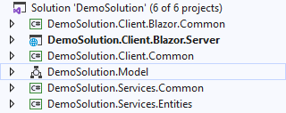
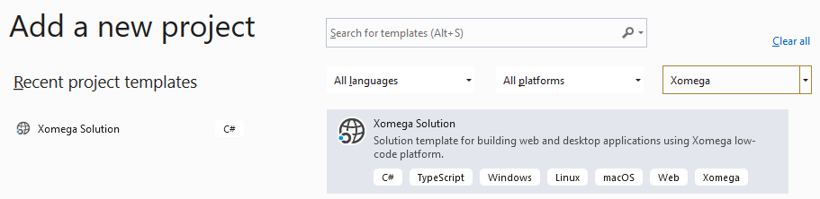
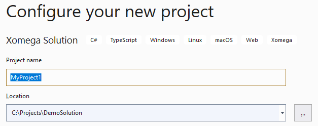
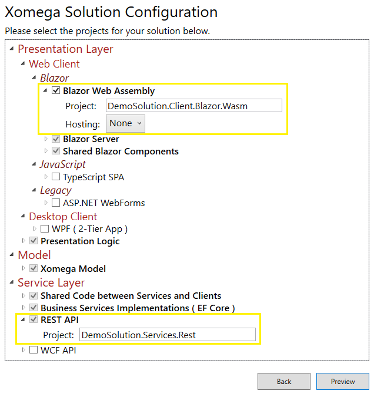
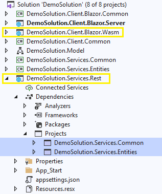

# Adding to Xomega Solutions

If you selected some projects when creating a new Xomega solution but then decided to include additional supported technologies, then you can use the same Xomega solution wizard to select and add new projects to your solution.

:::caution
The wizard will configure any new projects that you will add, but it **won't update any existing projects**, specifically the `.Model` project, like it would've had you selected those projects during the initial solution creation.

You will need to make any such updates to the existing projects manually.
:::

## Example: Adding WebAssembly to Blazor Server

For example, let's imagine that you initially created a `DemoSolution` for just the *Blazor Server* technology, which would look as follows.

Now you decided to add support for *Blazor WebAssembly* to your solution. To add the relevant projects, you can right-click on the *Solution* node, select *Add > New Project*, and pick `Xomega` as the project type, as follows.

In the next screen, you can leave the project name to be the default value.

This *Project name* won't matter since you can specify the project names in the Xomega solution configuration wizard, which will open up after you hit the *Create* button.

### Adding Web Assembly projects

The existing solution projects displayed in the Xomega solution configuration will not be editable, but you can add *Blazor Web Assembly* to the selection, which will also automatically select the *REST API* project, as follows.

:::note
Notice how the default project names are automatically generated based on the solution name here, and disregard the project name that you supplied in the previous screen.
:::

Once you finish adding the projects, you'll see the two new projects in your solution, preconfigured with proper dependencies on any existing projects, as shown below.

### Additional manual updates

In order to finish setting up the new projects, you'll need to make the following updates manually.

- Open properties of the *Service Layer > Web API Controllers* generator, set `Include In Build` parameter to `True`, and make sure that the output paths match the name of the new `.Services.Rest` project, and then run the generator.
- Open properties of the *Presentation Layer > Common > REST Service Clients* generator, set `Include In Build` parameter to `True`, and make sure that the output paths match the name of the existing `.Client.Common` project, and then run the generator.
- Set the `Generate Rest Methods` parameter to `True` on the *Full CRUD with Views* and *Read Enum Operation*, as well as on any other model enhancement generators that have this parameter, for future runs.

If you have already run the model enhancement generators and added operations without REST methods, you will need to add `rest:method` configurations to those operations as appropriate.

:::tip
To easily set up existing operations with a default `rest:method` configuration, you can create a copy of the *Read Enum Operation* generator, set all parameters except for the `Generate Rest Methods` to `False`, and then run that generator on the existing objects with operations.
:::