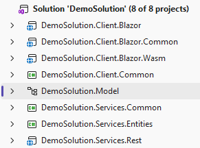
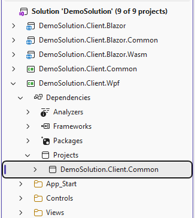
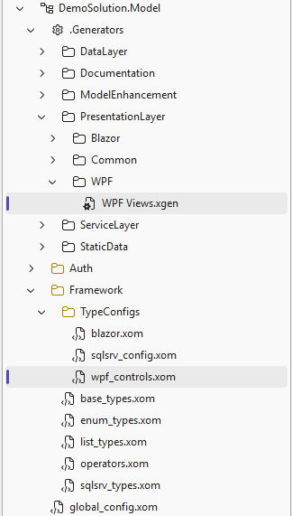

# Adding to Xomega Solutions

If you selected some projects when creating a new Xomega solution but then decided to include additional supported technologies, then you can use the same Xomega solution wizard to select and add new projects to your solution.

:::warning
The wizard will configure any new projects that you will add, but it **won't update any existing projects**, specifically the `.Model` project, like it would have, had you selected those projects during the initial solution creation.

You will need to make any such updates to the existing projects manually.
:::

## Example: Adding WPF client to a Blazor app

For example, let's imagine that you initially created a `DemoSolution` for Blazor Server + WebAssembly, but *with standalone REST API* that is not hosted by the Blazor project. Your solution structure would look as follows.



### Adding a new Xomega project

Now you decided to also add a desktop WPF client to your solution, which would use the existing REST API as the backend. To add the relevant projects, you can right-click on the *Solution* node, select *Add > New Project*, and pick `Xomega` as the project type, as follows.


In the next screen, you can leave the project name to be the default value.


This *Project name* won't matter since the wizard will use the existing solution name to generate a default name for the new project, which you can also update later.

### Adding WPF desktop client

The existing solution projects displayed in the Xomega solution configuration will not be editable, but you will be able to add a *WPF* desktop client to the selection and set the *API Tier* to `REST API`, as illustrated below.


:::note
Notice how the default project names are automatically generated based on the solution name here, and disregard the project name that you supplied in the previous screen.
:::

After you hit *Preview* and then *Create*, you'll see the new project in your solution, preconfigured with proper dependencies on any existing projects, as shown below.



### Additional manual updates

Now you have to update and configure any existing projects to support the newly added projects. Normally, when creating a new solution from scratch, those projects are automatically configured for the selected technologies by the solution wizard. However, since we added a new project to an existing solution, we'll need to configure the existing projects manually.

To make this process easier you should open another instance of Visual Studio and [create a new Xomega solution](new-solutions) for the WPF client with REST API in a separate folder, using the same solution name `DemoSolution`, which you'll use as a template. This will allow you to just copy any configuration from that folder into your existing solution.

#### Adding WPF controls type configs

Copy the `DemoSolution.Model\Framework\TypeConfigs\wpf_controls.xom` from the new template WPF solution that you created earlier to your existing solution. This will add the necessary type configurations for generating WPF controls in your existing solution.

#### Adding WPF Views generator

To add a *WPF Views* generator, copy the generator configuration file from the `.Generators\PresentationLayer\WPF\WPF Views.xgen` in your template WPF solution project to your existing project, and make sure the paths and namespaces match your existing solution, as illustrated below.

```xml title='.Generators\PresentationLayer\WPF\WPF Views.xgen'
<XomGeneratorConfig xmlns="http://schemas.xomega.net/v10/xgen"
                    xmlns:view="http://schemas.xomega.net/v10/xgen/views">
  ...
  <Generator Xsl="UI/WPF/wpf_views.xsl"
             GeneratorGroup="presentation"
             IncludeInBuild="true"
             IndividualFiles="true"/>

<!-- highlight-start -->
  <view:Output Path="../DemoSolution.Client.Wpf/Views/{Module/}{File}"
               RegistryFile="../DemoSolution.Client.Wpf/Views/Views.cs"
               MenuFile="../DemoSolution.Client.Wpf/Controls/MainMenu"/>

  <view:Parameters Namespace="DemoSolution.Client.Wpf"/>
<!-- highlight-end -->

</XomGeneratorConfig>
```


You should now be able to see the *WPF Views* generator under the *.Generators > Presentation Layer > WPF* folder, as well as the `wpf_controls.xom` that you included earlier, as shown below.



#### Adding assembly config for data objects

When generating WPF views, the generator needs to know the namespace and assembly where the data objects are located. Therefore, you need to update the `xfk:data-objects-config` element in the `global_config.xom` file to include the assembly name, as shown below.

```xml title="global_config.xom"
...
  <!-- configuration for generation of UI data objects -->
  <xfk:data-objects-config
    namespace="DemoSolution.Client.Common.DataObjects"
<!-- added-next-line -->
    assembly="DemoSolution.Client.Common"
  />
...
```

Now you want to right-click on the `DemoSolution.Model` project and select *Build* to generate any additional artifacts for the new project.

#### Other possible updates

If you initially had the REST API hosted by the Blazor application rather than as a standalone service, then you would need to do some additional updates, as described below.

- Copy the `DemoSolution.Services.Rest/Program.cs` file from the template solution to the existing REST API project to allow running it separately.
- Update the `DemoSolution.Services.Rest/AuthController` class to enable JWT authentication using the corresponding code from the template solution.
- Copy `DemoSolution.Client.Common/ServiceClients/Auth/JwtLoginServiceClient.cs` from the template solution to handle JWT authentication on the client.

Any other initial configurations or a different configuration of the new project may require additional manual updates, as appropriate.