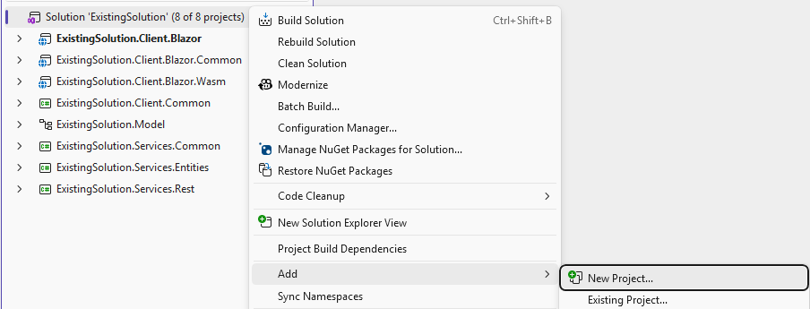
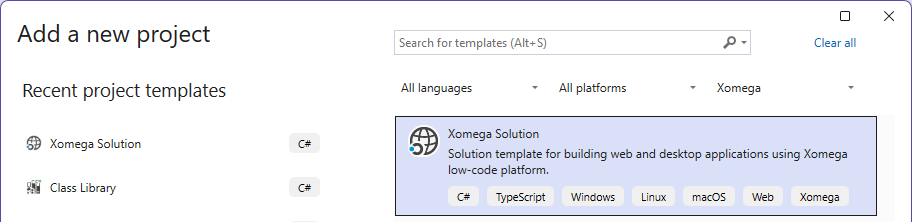
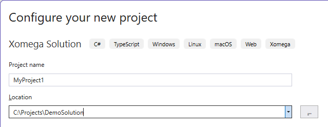
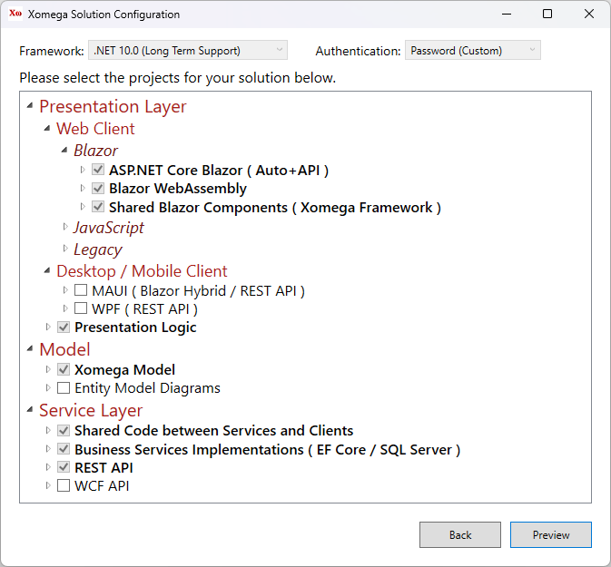
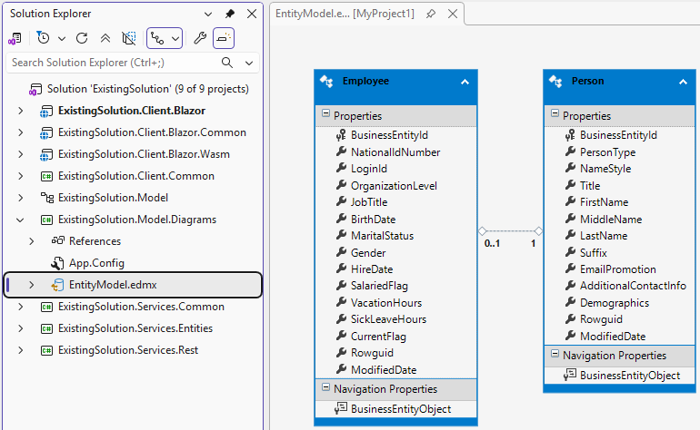
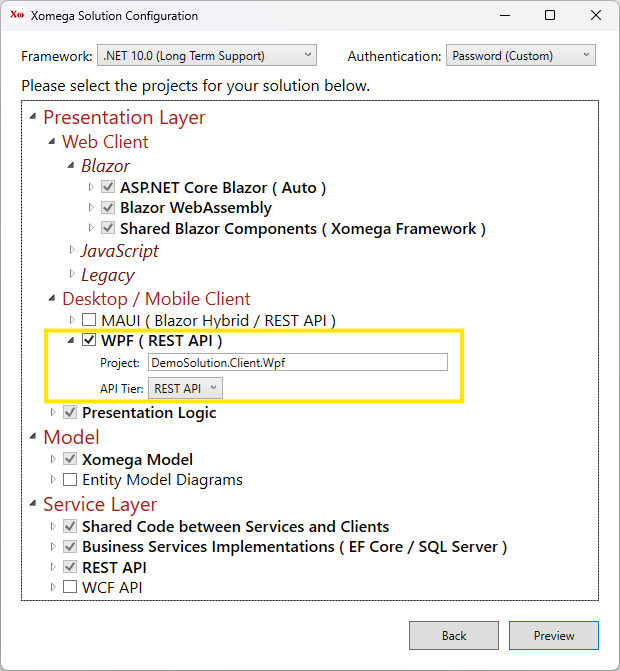
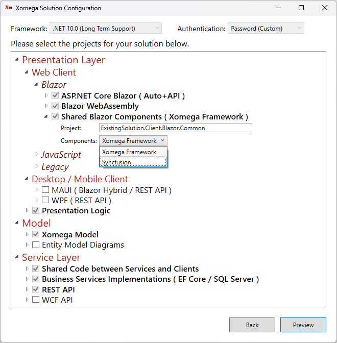

# Updating Xomega Solutions

If you [created a Xomega solution](new-solutions) with a certain set of projects and configuration, then you can easily add new Xomega projects to that solution later on, as well as change some configuration on the existing projects by using the same Xomega solution wizard that you used to create the solution.

## Solution update wizard

To launch the Xomega solution wizard for existing solutions, right-click on the *Solution* node and select *Add > New Project*, as follows.

Then, in the *Add a new project* dialog, select `Xomega` as the project type and *Xomega Solution* template, and click *Next*.

In the next screen, you can **skip populating the *Project name* and *Location*** fields, since the wizard will use the names of the existing projects in the solution, as well as solution's current location, and just click *Create* to proceed to the next screen.

The next screen will be the same *Xomega Solution Configuration* dialog that you used to [create the solution](new-solutions#selecting-solution-components), but with the existing solution configuration options prepopulated and disabled, where the solution wizard doesn't allow changing such configuration options, as illustrated below.

Existing projects in the solution will be selected and disabled in the wizard, since you can't remove any existing projects, but you can select additional projects to add to the solution and configure them as needed. Configuration options on the existing projects that cannot be changed in the wizard due to major solution updates required will be disabled as well. However, some existing configuration options can be changed, as described in the next sections.

### Files overwrite warning

Adding new projects to the existing solution, as well as changing some configuration options on the existing projects, may require not only adding new files to the solution, but also updating some existing files, which may **overwrite any custom changes** that you may have made to those files.

Specifically, new projects may require updates to the global model configuration file `global_config.xom`, project files that will be used by the new projects, as well as some startup project files `Program.cs` for additional configuration.

:::danger
Before updating your solution using the Xomega solution wizard, make sure to **commit any changes** that you may have in your source control, so that you can easily review any changes made by the wizard and revert any unwanted changes if needed.
:::

## Adding new Xomega projects

To add new Xomega projects to the existing solution, just select the desired project types in the wizard and configure them as needed. You can add any number of new projects of any type, and they will be properly configured with dependencies on any existing projects in the solution.

### Adding entity diagrams

If you want to be able to generate entity model diagrams for your model entities, then you can add a new [*Entity Model Diagrams*](solution-structure#solutionnamemodeldiagrams) project. In addition to the new project, this will also add [*Entity Data Model* generator](../../generators/data/edm) to the model project, as well as required EDM type mappings. The following screenshot illustrates the new project and the generated diagrams for the sample model.

### Adding modern projects

Xomega solutions are architected in a way that allows multiple UI projects using different technologies to coexist in the same solution and share the same model, services and even common presentation logic. For example, if your existing solution has a Blazor Server and WebAssembly projects, you can easily add a WPF desktop client project to the same solution and share the same model and services with it, as shown below.

:::note
Notice how the default project names are automatically generated based on the solution name here, and disregard the project name from the previous *Configure your new project* screen.
:::

Adding a WPF project will require updating the `global_config.xom` file to specify the assembly for the shared data objects, which may [overwrite any custom changes](#files-overwrite-warning) that you may have in that file.

Similarly, if your initial Blazor project was hosting the REST API for the WebAssembly client, then adding a new WPF project with REST API will require updating the `.Services.Rest` project to allow running it separately and enable JWT authentication, which may also overwrite any changes that you may have in that project. The same applies to adding other client projects with REST API, such as MAUI or SPA projects.

### Adding legacy projects

Xomega solution wizard also allows adding legacy projects that require .NET Framework, such as ASP.NET Web Forms or WCF. However, since those projects reuse the same presentation and/or service logic as the modern projects, you will need to update shared projects to enable multi-targeting for both .NET Framework and .NET to make this setup work.

This multi-targeting setup is supported if you select both legacy and modern projects in the wizard when creating the solution, but not when adding legacy projects to an existing solution with modern projects, since this is not something you normally would want to do in practice, so you'll need to make some manual updates to the project files for the shared projects.

## Updating Xomega projects

In addition to adding new projects to the existing solution, Xomega solution wizard also allows limited updates to the existing projects, as described below.

### Switching to Syncfusion components

If you initially created a Blazor project with `Xomega Framework` Blazor components, you can switch it to use Syncfusion Blazor components by changing the *Components* option on the *Shared Blazor Components* project to `Syncfusion` in the solution wizard, as shown below.

This will add type configurations for Syncfusion components to the Model project under `Framework/TypeConfigs/blazor_xsf.xom`, as well as the [*Syncfusion Blazor Views* generator](../../generators/presentation/blazor/views-xsf), which will be included in the Model build.

:::danger
This will also update the existing Blazor projects and their main files, such as `Program.cs`, `appsettings.json`, `_Imports.razor` and `App.razor` to switch to Syncfusion components, which may [**overwrite any custom changes**](#files-overwrite-warning) that you may have in those files.
:::

Note that switching to Syncfusion components will not remove the existing `blazor.xom` type configuration file and the [*Blazor Views* generator](../../generators/presentation/blazor/views), which will be excluded from the Model build. This allows you to easily switch back to the original Xomega Framework Blazor components if so desired. Therefore, the option to select Blazor *Components* in the wizard will become disabled after that.