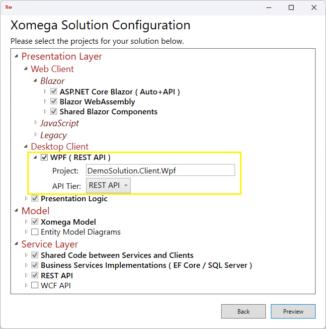
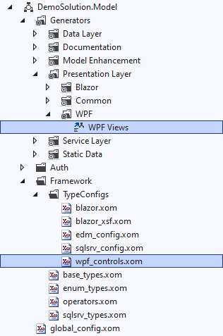

# Adding to Xomega Solutions

If you selected some projects when creating a new Xomega solution but then decided to include additional supported technologies, then you can use the same Xomega solution wizard to select and add new projects to your solution.

:::warning
The wizard will configure any new projects that you will add, but it **won't update any existing projects**, specifically the `.Model` project, like it would've had you selected those projects during the initial solution creation.

You will need to make any such updates to the existing projects manually.
:::

## Example: Adding WPF client to a Blazor app

For example, let's imagine that you initially created a `DemoSolution` for Blazor Server + WebAssembly, but *with standalone REST API* that is not hosted by the Blazor project. Your solution structure would look as follows.


### Adding a new Xomega project

Now you decided to also add a desktop WPF client to your solution, which would use the existing REST API as the backend. To add the relevant projects, you can right-click on the *Solution* node, select *Add > New Project*, and pick `Xomega` as the project type, as follows.


In the next screen, you can leave the project name to be the default value.


This *Project name* won't matter since the wizard will use the existing solution name to generate a default name for the new project, which you can also update later.

### Adding WPF desktop client

The existing solution projects displayed in the Xomega solution configuration will not be editable, but you will be able to add a *WPF* desktop client to the selection and set the *API Tier* to `REST API`, as illustrated below.



:::note
Notice how the default project names are automatically generated based on the solution name here, and disregard the project name that you supplied in the previous screen.
:::

After you hit *Preview* and then *Create*, you'll see the new project in your solution, preconfigured with proper dependencies on any existing projects, as shown below.


### Additional manual updates

Now you have to update and configure any existing projects to support the newly added projects. Normally, when creating a new solution from scratch, those projects are automatically configured for the selected technologies by the solution wizard. However, since we added a new project to an existing solution, we'll need to configure the existing projects manually.

To make this process easier you should open another instance of Visual Studio and [create a new Xomega solution](new-solutions) for the WPF client with REST API in a separate folder, using the same solution name `DemoSolution`, which you'll use as a template. This will allow you to just copy any configuration from that folder into your existing solution.

#### Adding WPF controls type configs

Copy the `DemoSolution.Model\Framework\TypeConfigs\wpf_controls.xom` from the new template WPF solution that you created earlier to your existing solution. Then, in the existing solution, select the `DemoSolution.Model` project in *Solution Explorer*, click *Show All Files*, right-click on the `wpf_controls.xom` that you copied and select *Include In Project*.

#### Adding WPF Views generator

To add any generators to the *Model* project, right-click on that project and select *Unload Project*. This will allow you to edit the `DemoSolution.Model.xomproj` file directly in Visual Studio.

To add a *WPF Views* generator, copy the generator configuration from the template WPF solution project to your existing project, as illustrated below.

```xml title='DemoSolution.Model.xomproj'
...
</XomGenerator>
<!-- added-lines-start -->
<XomGenerator Include="$(XomegaHome17)Xsl\wpf_views.xsl">
  <Name>WPF Views</Name>
  <Folder>Presentation Layer\WPF</Folder>
  <CustomPath-param>
  </CustomPath-param>
  <CustomPath-desc>
	Path where to output override classes for the generated Views.
	If not set then the OutputPath will be used. The path must contain {File} placeholder to output files by view.
  </CustomPath-desc>
  <CustomPath-category>Output</CustomPath-category>
  <OutputPath-param>../DemoSolution.Client.Wpf/Views/{Module/}{File}</OutputPath-param>
  <OutputPath-desc>Path where to output files with generated WPF views. Path must contain {File} placeholder.</OutputPath-desc>
  <OutputPath-category>Output</OutputPath-category>
  <RegistryFile-param>../DemoSolution.Client.Wpf/Views/Views.cs</RegistryFile-param>
  <RegistryFile-desc>A path to the file for views registration.</RegistryFile-desc>
  <RegistryFile-category>Output</RegistryFile-category>
  <MenuFile-param>../DemoSolution.Client.Wpf/Controls/MainMenu</MenuFile-param>
  <MenuFile-desc>Path where to output generated menu resources without extension.</MenuFile-desc>
  <MenuFile-category>Output</MenuFile-category>
  <Namespace-param>DemoSolution.Client.Wpf</Namespace-param>
  <Namespace-desc>Namespace for the generated views.</Namespace-desc>
  <View-param></View-param>
  <View-desc>The name of the view from the model to generate a view for.</View-desc>
  <View-category>Selector</View-category>
  <IncludeInBuild>true</IncludeInBuild>
  <IndividualFiles>true</IndividualFiles>
  <GeneratorGroup>presentation</GeneratorGroup>
</XomGenerator>
<!-- added-lines-end -->
<XomGenerator Include="C:\Program Files\Xomega.Net\9.12\Xsl\enum_cache.xsl">
...
```

Save the `DemoSolution.Model.xomproj` file, and then right-click on the `DemoSolution.Model` project in the *Solution Explorer* and select *Reload Project*. You should now be able to see the *WPF Views* generator under the *Generators > Presentation Layer > WPF* folder, as well as the `wpf_controls.xom` that you included earlier, as shown below.



Now you want to right-click on the `DemoSolution.Model` project and select *Build* to generate any additional artifacts for the new project.

#### Other possible updates

If you initially had the REST API hosted by the Blazor application rather than as a standalone service, then you would need to do some additional updates, as described below.

- Copy the `DemoSolution.Services.Rest/Program.cs` file from the template solution to the existing REST API project to allow running it separately.
- Update the `DemoSolution.Services.Rest/AuthController` class to enable JWT authentication using the corresponding code from the template solution.
- Copy `DemoSolution.Client.Common/ServiceClients/Auth/JwtLoginServiceClient.cs` from the template solution to handle JWT authentication on the client.

Any other initial configurations or a different configuration of the new project may require additional manual updates, as appropriate.