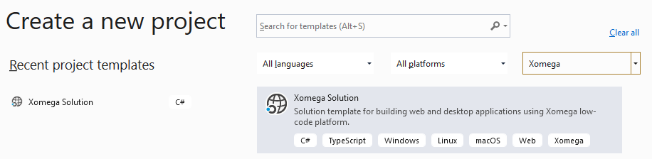
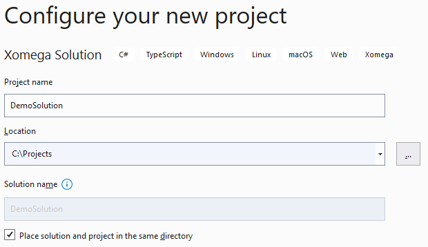
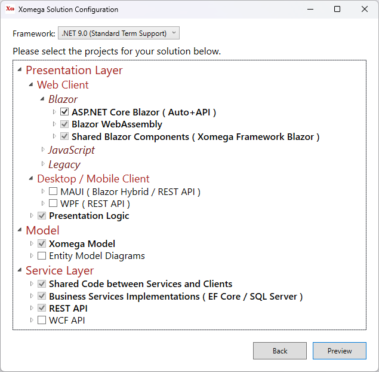
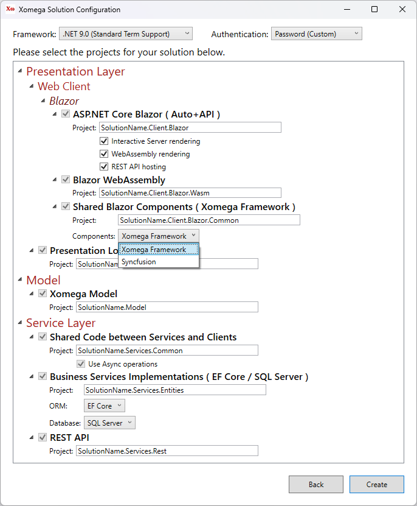

# Creating a Xomega Solution

Xomega.Net adds a new project template to Visual Studio that allows you to create and configure your solution for a specific architecture.

:::warning
This documentation applies only to the current versions of **Xomega.Net for Visual Studio 2019**.

The older version of *Xomega.Net for Visual Studio 2017* provides multiple pre-configured solution templates to select from, without the ability to further configure them interactively.
:::

## Xomega project template

:::caution
Due to a current limitation, you should not try to create a new Xomega solution (or open an existing one), when you have another Xomega solution open in your Visual Studio. You should first restart the Visual Studio in this case.
:::

To create a new Xomega solution select the *New Project* option in your Visual Studio and then pick *Xomega* project type to find the *Xomega Solution* template, as shown below.

Select the* Xomega Solution* template, and click *Next* to get to the following screen.

Set the project name, enter the location folder to create the solution in, optionally check the checkbox to place solution and project in the same directory, and click *Create*.

## Selecting solution components

You should see a *Xomega Solution Configuration* screen, which allows you to pick and configure client-side and server-side technologies and projects that you want to use in your solution.

Usually, you just need top pick the main client-side technology, and any other projects that are required for your selection will be automatically included in the solution as well.

The following picture shows required projects for the *Blazor Server* technology.

If you want to target several technologies at the same time, such as WPF, you can select additional projects here, and they'll share most of the presentation and business logic of your solution.

Similarly, you can pick additional service layer projects, e.g. to expose your services via REST API. This will allow you to build a 3-tier WPF app that communicates to the business services middle tier via REST API, rather than an old-style 2-tier desktop app that calls the database directly.

## Reviewing solution configuration

Once you select the projects for your solution, you can click *Preview* to view and update configuration of the selected projects.

You can customize the name of each project, and specify project-specific options, such as which Blazor components to use, as shown below.

:::tip
You can also specify this configuration for each project on the previous screen by expanding the corresponding projects.
:::

### Solution configuration parameters

Here's the full list of parameters that you can configure for different solution projects.

- **Blazor WebAssembly**
  - *Project* - the name of the project to use.
  - *Hosting* - the hosting model to use, as follows.
    - `None` - self-hosting model.
    - `ASP.NET Core` - hosted in the ASP.NET Core project specified by the *Blazor Server* selection.
- **Blazor Server**
  - *Project* - the name of the project to use.
- **Shared Blazor Components**
  - *Project* - the name of the project to use.
  - *Components* - Blazor component library to use, as follows.
    - `Xomega Framework Blazor` - standard Bootstrap-styled Blazor components for Xomega Framework.
    - `Xomega Syncfusion Blazor` - Syncfusion Blazor components adapted for Xomega Framework.
- **TypeScript SPA**
  - *Project* - the name of the project to use.
- **ASP.NET WebForms**
  - *Project* - the name of the project to use.
- **WPF**
  - *Project* - the name of the project to use.
  - *API Tier* - the way app will access business services, as follows.
    - `2-Tier App` - business services are built into the app, which will access the DB directly.
    - `REST API` - business services are hosted separately and accessed via REST API.
    - `WCF API` - business services are hosted separately and accessed via WCF API.
- **Presentation Logic**
  - *Project* - the name of the project to use.
- **Xomega Model**
  - *Project* - the name of the project to use.
- **Shared Code between Services and Clients**
  - *Project* - the name of the project to use.
  - *Operations* - synchronous or asynchronous way service operations are defined, as follows.
    - `Asynchronous` - service operations are async, which should be used for most configurations.
    - `Synchronous` - service operations are synchronous, which should be used in very special legacy cases.
- **Business Services Implementations**
  - *Project* - the name of the project to use.
  - *ORM* - Object-Relational Mapping framework to use, as follows.
    - `EF Core` - use newer Entity Framework Core.
    - `EF 6.x` - use older Entity Framework 6.x.
- **REST API**
  - *Project* - the name of the project to use.
- **WCF API**
  - *Project* - the name of the project to use.

We will describe the details of each project in the [next section](solution-structure.md). Normally, you can just stick to the default configuration for most components, and then click the *Create* button to create your solution.