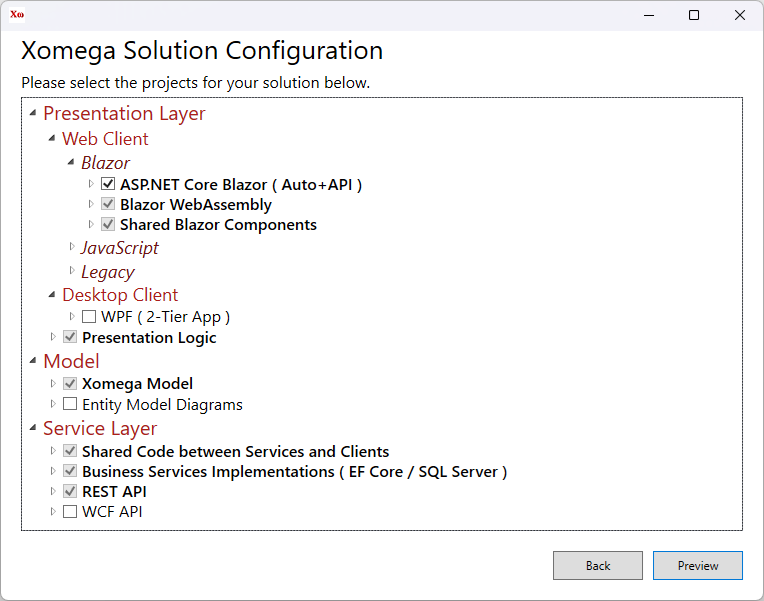
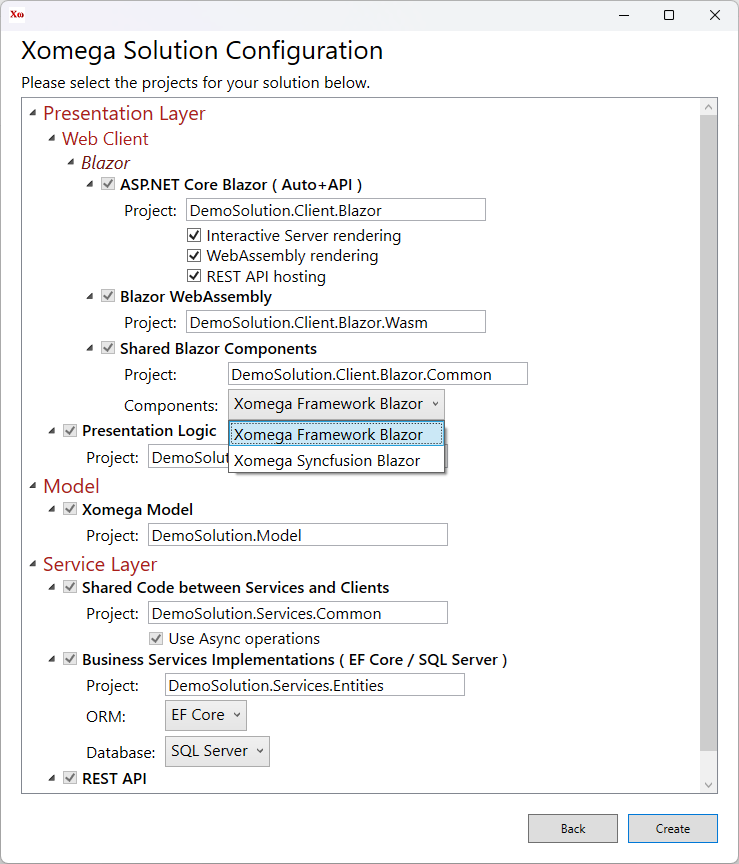

# Creating a Xomega Solution

Xomega.Net adds a new project template to Visual Studio that allows you to create and configure your solution for a specific architecture.

:::danger
This documentation applies only to the current version of Xomega.Net **for Visual Studio 2022**.
:::

## Xomega project template

:::warning
Due to a current limitation, you should not try to create a new Xomega solution (or open an existing one) when you have another Xomega solution open in your Visual Studio. You should first restart Visual Studio in this case.
:::

To create a new Xomega solution, select the *New Project* option in your Visual Studio and then pick *Xomega* project type to find the *Xomega Solution* template, as shown below.

Select the *Xomega Solution* template, and click *Next* to get to the following screen.

Set the project name, enter the location folder to create the solution in, optionally check the checkbox to place the solution and project in the same directory, and click *Create*.

## Selecting solution components

You should see a *Xomega Solution Configuration* screen, which allows you to pick and configure client-side and server-side technologies and projects that you want to use in your solution.

Usually, you just need to pick the main client-side technology, and any other projects that are required for your selection will be automatically included in the solution as well.

The following picture shows the required projects for the *Blazor* technology that includes *Blazor Server* and *Blazor WebAssembly* with `InteractiveAuto` rendering mode, and has a hosted REST API for the *WebAssembly*.

If you want to target several technologies at the same time, such as WPF, you can select additional projects here, and they'll share most of the presentation and business logic of your solution.

Similarly, you can pick additional service layer projects, e.g., to expose your services via WCF API to some legacy clients that cannot consume REST API for some reason.

## Reviewing solution configuration

Once you select the projects for your solution, you can click *Preview* to view and update the configuration of the selected projects.

You can customize each project's name and select project-specific options, such as which Blazor components to use, as shown below.

:::tip
You can also specify this configuration for each project on the previous screen by expanding the corresponding projects.
:::

Some key configuration of a project may be also displayed next to that project in parenthesis, e.g. *( Auto + API )*.

:::warning
Changing some configurations may result in other projects becoming included or excluded. For example, if you uncheck the *WebAssembly rendering* option, this will remove the *Blazor WebAssembly* and *REST API* projects from the selection.
:::

### Solution configuration parameters

Below is the full list of parameters that you can configure for different solution projects.

- **ASP.NET Core Blazor** - the main project for Blazor solutions.
  - *Project* - the name of the project to use.
  - *Interactive Server rendering* - use Blazor Server for interactive screens.
  - *WebAssembly rendering* - host and use Blazor WebAssembly for interactive screens. If *Interactive Server rendering* option is also selected, the solution will use the `InteractiveAuto` rendering mode.
  - *REST API hosting* - host REST API for WebAssembly in this Blazor project rather than as a standalone project.
- **Blazor WebAssembly** - part of the main Blazor project, if *WebAssembly rendering* is selected. Otherwise, a standalone WebAssembly project with a separate REST API.
  - *Project* - the name of the project to use.
- **Shared Blazor Components** - components shared between Blazor Server and WebAssembly projects.
  - *Project* - the name of the project to use.
  - *Components* - Blazor component library to use, as follows.
    - `Xomega Framework Blazor` - standard Bootstrap-styled Blazor components for Xomega Framework.
    - `Xomega Syncfusion Blazor` - Syncfusion Blazor components adapted for Xomega Framework.
- **TypeScript SPA** - TypeScript-based web client that uses [XomegaJS](https://github.com/Xomega-Net/XomegaJS) and `knockout.js` frameworks.
  - *Project* - the name of the project to use.
- **ASP.NET WebForms** - legacy ASP.NET web client.
  - *Project* - the name of the project to use.
- **WPF** - desktop client for WPF applications.
  - *Project* - the name of the project to use.
  - *API Tier* - the way the app will access business services, as follows.
    - `2-Tier App` - business services are built into the app, which will access the DB directly.
    - `REST API` - business services are hosted separately and accessed via REST API.
    - `WCF API` - business services are hosted separately and accessed via WCF API.
- **Presentation Logic** - presentation logic that can be shared between all clients.
  - *Project* - the name of the project to use.
- **Xomega Model** - project for modeling your domain and service models, from which application layers are generated.
  - *Project* - the name of the project to use.
- **Shared Code between Services and Clients** - DTOs, service interfaces and other shared code.
  - *Project* - the name of the project to use.
  - *Use Async operations* - use asynchronous service operations. Synchronous operations should be used in very special legacy cases.
- **Business Services Implementations** - domain entities and implementations of service interfaces.
  - *Project* - the name of the project to use.
  - *ORM* - Object-Relational Mapping framework to use, as follows.
    - `EF Core` - use newer Entity Framework Core.
    - `EF 6.x` - use older Entity Framework 6.x.
- **REST API** - controllers for exposing business services via REST API.
  - *Project* - the name of the project to use.
- **WCF API** - business services exposed via legacy WCF API.
  - *Project* - the name of the project to use.

We will describe the details of each project in the [next section](solution-structure). Normally, you can just stick to the default configuration for most components and then click the *Create* button to create your solution.