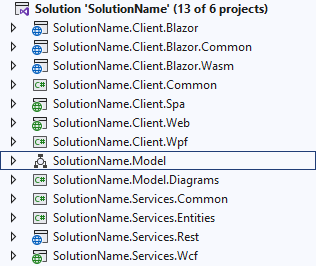

# Xomega Solution Structure

After you create a solution using Xomega solution wizard, you will see your selected projects in the *Solution Explorer*.

For example, if you specify *SolutionName* as the initial project name, pick all components from the solution wizard, and keep the default naming conventions for the projects, then you will see the following projects created in your new solution.

Let's review the default structure of each project in the Xomega solution.

## Xomega model project

In the middle of the solution, between client and services projects, you'll find a special Xomega model project that ends with `.Model`.

### *SolutionName*.Model

The model project combines `.xom` files that store Xomega model elements and configurations, as well as various generators that you can run on your model. We discuss the structure of the model project in the [next chapter](../model-project/project-structure).

## Shared project

Xomega solution will contain one C# project that is shared between services and the client projects, as follows.

### *SolutionName*.Services.Common

This project should have minimal dependencies, and contains any code or resources that are shared between the service layer and the clients.

By convention, different types of shared artifacts are grouped into their own folders, as follows.

- **ServiceContracts** contains interfaces for the services and structures for the corresponding data contracts (i.e. DTOs).
- **Enumerations** contains constants for static enumerations and their items/properties, as well as for attributes of dynamic enumerations. It also contains XML data for static enumerations in the `enumerations.xres` file, which is loaded into the Xomega Framework's lookup cache.
- **CacheLoaders** contains lookup cache loaders for loading dynamic or contextual lookup data from the service operations, so that it could be used for lookup and validation both on the client and server sides. It also contains a convenient method for registering those with the DI container.

:::note
Most of those classes are auto-generated from the Xomega model, but you can also add any custom code that needs to be shared between client-side and server-side logic, such as helper classes for security checks, etc.
:::

## Services projects

The following projects are used to implement business services for your solution, and to expose them to the client(s).

### *SolutionName*.Services.Entities

This project contains *Entity Framework*'s domain entities for your solution with the configuration of the `DbContext`, and provides implementation of the business services defined in the `.Services.Common` project using those entities.

:::info
This project has **no dependencies** on any server-side frameworks, such as ASP.NET Core, so that it could be (re)used from any server-side or client-side frameworks.
:::

By convention, the entities and the services are grouped into the following folders, which can be further broken down by module.
- **Entities** contains the *Entity Framework* entities and the `DbContext` configuration.
- **Services** contains implementation of the business services.

:::note
These folders may include both classes generated from the Xomega model, and any custom extensions or subclasses with overridden implementations.
:::

The project also includes a `DbContextValidation` class that has some helper validation methods that are used by the service implementations.

### *SolutionName*.Services.Rest

This project allows exposing business services implemented in the `.Services.Entities` project via REST API using ASP.NET Core.

Initially, it will have an `App_Start` folder that contains startup and configuration code, as well as a sample `AuthenticationController` for password-based authentication.

Once you define RESTful operations in the Xomega model, it will also have generated controllers for those services and operations.

:::note
You can also add your own classes to customize the behavior of the generated controllers, or provide additional Web API logic.
:::

### *SolutionName*.Services.Wcf

This project allows exposing business services implemented in the `.Services.Entities` project via legacy WCF framework hosted using ASP.NET.

By default, it has a startup class `WcfAppInit` with initialization logic, and a set of classes under the `Sts` folder that help you implement a *Security Token Service* that is needed to set up security for the WCF services.

Otherwise, it will have generated `.svc` service host files for the Xomega business services defined in the model.

## Client projects

Based on your configuration, the Xomega solution will have a number of projects that are used on the client side of your app. Below you will find detailed descriptions of these projects for various types of clients.

### *SolutionName*.Client.Common

This project contains common C# presentation logic for your solution that is shared between various C#-based clients.

:::info
This project should have **no dependencies** on any specific UI framework, such as Blazor, to allow sharing it with other C# clients, and to support an easy migration of your app to any future UI technologies, such as MAUI.
:::

By convention, the common client classes are grouped by their types into the following folders.
- **DataObjects** contains Xomega Framework data objects that are bound to UI views.
- **ServiceClients** contains proxy services for calling business services via REST.
- **ViewModels** contains Xomega Framework view models that include data objects, and provide additional platform-agnostic presentation logic for the UI views, such as navigation.

:::note
These folders may include both classes generated from the Xomega model, and any custom extensions or subclasses with overridden implementations.
:::

In addition to the classes, this project also contains the following common resource files for the UI views.
- `Labels.resx` contains resources generated from the Xomega model.
- `Resources.resx` contains any custom common resources that may override the generated ones, or provide additional resources, such as custom validation messages.

### *SolutionName*.Client.Blazor.Common

This project contains Blazor views, components and other resources that can be shared between *Blazor Server* and *Blazor Web Assembly* projects.

:::info
The project should have **no dependencies** on ASP.NET Core or the specific flavor of the Blazor implementation, in order to remain sharable between different types of Blazor clients.
:::

The project contains the following folders and files.
- **Components** folder contains shared Blazor components, such as the `MainLayout`, `LoginDisplay` and `NotAuthenticated` component.
- **Views** folder contains generated and custom Blazor views and a menu structure, including a home page.
- **wwwroot** folder contains shared resources such as CSS files, javascript and images.
- `App.razor` file defines the main application component.

### *SolutionName*.Client.Blazor.Server

This project contains ASP.NET Core startup and setup code for a *Blazor Server* client that uses application views and components from the `.Client.Blazor.Common` project.

The **Pages** folder contains the main `_Host.cshtml` razor page for the app, as well as additional razor pages `SignIn.cshtml` and `SignOut.cshtml` that help you with cookie-based Blazor authentication using Xomega Framework support.

### *SolutionName*.Client.Blazor.Wasm

This project contains ASP.NET Core Web Assembly startup and setup code for a *Blazor Web Assembly* client that uses application views and components from the `.Client.Blazor.Common` project.

It has the main `index.html` page for the app under the **wwwroot** folder, and a custom `AuthenticationStateProvider` implementation that helps configure Blazor Web Assembly authentication for Xomega Framework.

### *SolutionName*.Client.Wpf

This project contains the code for a WPF desktop client for your application that targets .NET5. The root folder contains the main application in the `App.xaml` files, the main window in the `MainView.xaml` files, and other application files in sub-folders, as follows.

- **App_Start** folder contains DI-enabled application initialization code.
- **Controls** folder contains common WPF controls that are used in the application views, e.g. for displaying errors.
- **Views** folder contains generated XAML views with the code-behind that use view models and bind to data objects from the `.Client.Common` project.

### *SolutionName*.Client.Web

This project contains the code for legacy ASP.NET WebForms web client that targets .NET Framework. The root folder contains the main application master page in the `Site.Master` files, and other application files in sub-folders, as follows.

- **App_Start** folder contains DI-enabled application initialization code for Owin.
- **Content** folder contains web application resources, such as CSS and images.
- **Controls** folder contains common WebForms user controls that are used in the web views, e.g. for displaying errors.
- **Scripts** folder contains javascript resources and libraries.
- **Views** folder contains generated ASPX views with the code-behind that use view models and bind to data objects from the `.Client.Common` project.

### *SolutionName*.Client.Spa

This project contains a web client as a TypeScript-based Single Page Application (SPA). It uses business services exposed via REST API, and is implemented with [XomegaJS](https://github.com/Xomega-Net/XomegaJS) framework backed by the `Knockout.js` library, as well as with the `Durandal` framework.

:::caution
Because this client is implemented with TypeScript and HTML, it cannot reuse any of the shared common C# projects, and therefore needs to re-implement all the presentation logic in TypeScript.
:::

The root folder contains main application initialization code and markup, as well as the following sub-folders.

- **App_Start** contains app startup and configuration code.
- **CacheLoaders** contains XomegaJS lookup cache loaders for loading contextual lookup data from the service operations, so that it could be used for lookup and validation.
- **Content** folder contains web application resources, such as CSS and images.
- **DataObjects** contains XomegaJS data objects that are bound to UI views.
- **Enumerations** contains TypeScript constants for static enumerations and their items/properties, as well as for attributes of dynamic enumerations.
- **ServiceContracts** contains TypeScript data contracts (i.e. DTOs), and service methods that call the corresponding REST API.
- **Scripts** folder contains javascript resources and libraries.
- **Views** folder contains generated and custom views with HTML markup and TypeScript view models.
- **Widgets** folder contains common components that are used in the views.
